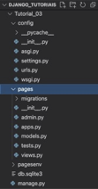
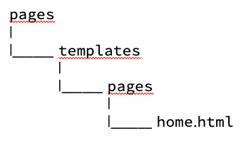
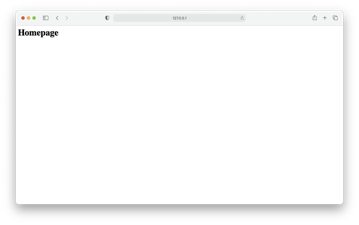
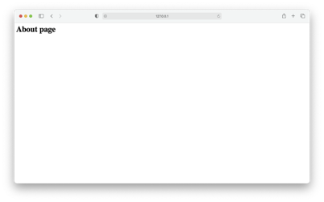

# Tutorial Django 03 - Criando Uma Aplicação Web Com Uma Página "*Home*" e outra "*About*"

Neste tutorial vamos construir uma "**app**" chamada "**Pages**" que possui duas páginas da web. Uma chamada "**Home**" e outra chamada "**About**". Vamos aprender também sobre "*Views*" do Django baseada em Classes e "Templates". Para isto, siga atentamente os passos abaixo.

**Observação Importante: faça isso somente depois de fazer o Tutorial 01, que trata da instalação do Python e Visual Studio Code.**

## **Passo 1: Configure seu ambiente de desenvolvimento**

Sempre que você estiver iniciando um projeto de desenvolvimento web, é uma boa ideia configurá-lo primeiro.

1.1) Abra o Terminal no VS Code. Primeiro digite (CTRL+Shift+P) e use a opção “**View: Toggle Terminal**” ou “**Ver: Alternar Terminal**”.

1.2) Digite na linha de comando do Terminal:

```
cd Django_Tutoriais
mkdir Tutorial_03
cd Tutorial_03
```

1.3) Uma vez dentro do diretório (“**Tutorial_03**”), crie um ambiente virtual. Para isto, digite o comando a seguir:

```
python3 -m venv pagesenv
```

Caso esteja usando o **Windows**:

```
py -m venv pagesenv
```

1.4) Agora você precisa ativar o ambiente virtual criado no item anterior, executando o comando abaixo:

**Linux/Mac**

```
source pagesenv/bin/activate
```

**Windows**

```
.\pagesenv\Scripts\activate.bat
```

Ou

```
.\pagesenv\Scripts\Activate.ps1
```

Você saberá que seu ambiente virtual foi ativado, porque o _prompt_ do console no Terminal mudará. Deve ser assim:

```
(pagesenv) $
```

1.5) Agora que você criou um ambiente virtual, é hora de instalar o **Django**. Digite na linha de comando:

```
(pagesenv) $ pip install django
```

##**Passo 2: Criando seu projeto em Django**

2.1) Certifique-se de que você está dentro do diretório “**Tutorial_03**” e o ambiente virtual ativado. Agora, digite o comando abaixo para criar um projeto.

```
(pagesenv) $ django-admin startproject config .
```

**Observação: ao criar um novo projeto Django chamado “config” certifique-se de incluir o ponto (.) no final do comando para que ele seja instalado no diretório atual.**

O comando acima irá criar uma pasta chamada “**config**” contendo alguns arquivos. No painel esquerdo do **VS Code**, você verá uma estrutura de diretório que se parece com a figura abaixo.


Explicando cada arquivo da pasta “**config**”:

**config/__init__.py**

_Arquivo que diz ao Python quais pacotes usar para este projeto. Ele começa vazio._

**config/asgi.py**

_Arquivo que representa um ponto de integração para servidores web compatíveis com ASGI (_**_Asynchronous Server Gateway Interface_**_) usado para servir seu projeto. Ele serve para fazer o “deploy” da sua aplicação._

**config/settings.py**

_É um arquivo_ **_muito_** **_importante_** _porque contém as configurações do projeto, tais como configurações do Banco de Dados, aplicativos instalados, configuração de arquivos estáticos e muito mais._

**config/urls.py**

_Aqui vamos dizer ao Django_ **_quem_** _responde a_ **_qual_** _URL. Também chamado de_  `URLConf`.

**config/wsgi.py**

_Aqui configuramos a interface entre o servidor de aplicação e nossa aplicação Django (WSGI - Web Server Gateway Interface). Também serve para fazer o “deploy” da aplicação._

E por último, temos o arquivo abaixo que está na pasta “**Django_Tutoriais**”:

**manage.py**

_Arquivo gerado automaticamente pelo Django que expõe comandos importantes para manutenção da nossa aplicação. Ele permite a você interagir com esse projeto Django de várias maneiras._


## **Passo 3: Testando seu servidor Django**

3.1) Depois que sua estrutura de arquivos estiver configurada, você pode iniciar o servidor de desenvolvimento que já vem embutido no Django. Para verificar se a configuração foi bem-sucedida, execute o seguinte comando no console do Terminal:

```
python manage.py runserver
```

3.2) Observe no console do Terminal as mensagens da figura abaixo:


Ignore os avisos sobre migrações não aplicadas por enquanto. Isto porque não estamos usando um Banco de Dados neste tutorial.

Ao posicionar o mouse no link "http://127.0.0.1:8000/" você verá a seguinte mensagem:


No **Windows** irá aparecer “**Seguir o link (ctrl + click)**”. Ao efetuar esta operação, você será direcionado para uma aba do seu browser, e, se tudo estiver correto, você verá uma página da web como a da figura abaixo.


3.3) Parabéns, você acabou de criar um projeto, nossa configuração está correta e você o testou no servidor de desenvolvimento. Agora o Django está pronto para começarmos a desenvolver.


## **Passo 4: Criando uma aplicação em Django**

Para esta parte do tutorial, criaremos uma “**app**” chamada "**pages**".

4.1) Para criar uma “**app**”, execute o seguinte comando:

```
python manage.py startapp pages
```

Este comando irá criar um diretório chamado “**pages**” com vários arquivos. Veja a estrutura na figura abaixo.




4.2) Agora que você criou a “**app**”, temos que “instalá-la” no seu projeto. Abra o arquivo (“**config/settings.py**”) e adicione a seguinte linha de código destacada em INSTALLED_APPS: (**Não se esqueça de colocar a vírgula após a _string_**).


Essa linha de código indica que seu projeto agora sabe que o aplicativo que você acabou de criar existe.

Surge uma pergunta: de onde obtivemos a referência a “**pages**”?

Resposta: quando criamos uma nova “**app**”, no **Passo 4.1**, o Django gerou um arquivo chamado “**apps.py**” na pasta “**pages**”. E dentro desse arquivo, ele criou uma classe chamada `PagesConfig`. Essa classe nos permite fazer referência ao aplicativo (i.e. ao “**app**”) para o projeto. O conteúdo do arquivo “**pages/apps.py**” está abaixo.

```python
from django.apps import AppConfig

class PagesConfig(AppConfig):
    default_auto_field = 'django.db.models.BigAutoField'
    name = 'pages'
```


## **Passo 5: Criando um Template**

Cada framework da web precisa de uma maneira conveniente de gerar arquivos HTML, e no Django a abordagem é usar “**Templates**” (i.e. modelos), que são arquivos HTML individuais que podem ser vinculados entre si e incluem a lógica básica também.
Lembre-se de que no **Tutorial 02** nosso site “*Hello_World*” tinha uma frase codificada no arquivo “**views.py**” como uma string. Isso funciona tecnicamente, mas não se adapta bem! 

Uma abordagem melhor é vincular uma “View” a um “Template”, separando assim as informações contidas em cada um.
Neste tutorial, aprenderemos como usar os “**templates**” para criar mais facilmente nossa página inicial (i.e. “**Homepage**”) e a página “**About**”. 

Surge uma dúvida. Onde colocar os “**templates**” dentro da estrutura de um projeto Django? Existem duas opções. 

A primeira, por default, o carregador de “**templates**” do Django procurará em cada “**app**” pelos “**templates**” relacionados. No entanto, a estrutura é um tanto confusa: cada “app” precisa de um novo diretório de “**templates**”, dentro deste outro diretório com o mesmo nome da “**app**” e, em seguida, o arquivo de “**templates**”. Portanto, em nossa “**app**” chamada de “**pages**”, o Django teria o seguinte layout:



Isso significa que precisaríamos criar um novo diretório chamado “**templates**”, um novo diretório com o nome da “**app**”, que se chama “**pages**” e, finalmente, nosso próprio “**template**” que é “**home.html**”.

Por que essa opção aparentemente é repetitiva? A resposta é que o carregador de “**template**” do Django quer ter certeza de que encontrou o correto! O que acontecerá se houver arquivos “**home.html**” em duas “**apps**” separados? Essa estrutura garante que não haja tais conflitos.

Há, no entanto, outra opção, que consiste em criar um único diretório chamado de “**templates**” colocar todos nossos modelos dentro dele. Para fazer isto, faremos um pequeno ajuste em nosso arquivo “**config/settings.py**”, para dizer ao Django procurar os “**templates**” neste diretório. Essa é que usaremos.

Primeiro, caso seja necessário, tecle “CTRL+C” para encerrar o servidor de desenvolvimento.

5.1)	Crie um diretório chamado “**templates**” dentro da pasta “**pages**” com o comando abaixo:

```
mkdir templates
```

5.2)	Abra o arquivo “**settings.py**” no diretório (“**config/settings.py**”). Precisamos mostrar para o Django a localização desta nova pasta, que chamamos de “**templates**”. Esta é uma alteração de uma linha no código para a configuração '**DIRS**' em **TEMPLATES**.

```
TEMPLATES = [
    	{
        ...
        'DIRS': [str(BASE_DIR.joinpath('templates'))], 
        ...
}, 
]
```

5.3)	Crie um arquivo chamado “**home.html**” no diretório (“**templates/home.html**”). Dentro dele, digite o conteúdo abaixo e após, salve-o. 

```html
<!-- templates/home.html -->
<h1>Homepage</h1>
```


## **Passo 6: Criando uma View**

Em nossa “View”, usaremos uma classe do Django chamada “TemplateView” para exibir nosso “template”. Esta classe contém toda a lógica necessária para exibi-lo. Só precisamos especificar o nome dele. Para isto, siga os passos abaixo.

6.1) Abra o arquivo “**views.py**” no diretório (“**pages/views.py**”). Já existe uma linha de código lá que importa o método “**render()**”.

```python
from django.shortcuts import render
```

Agora adicione o seguinte código a este arquivo (em destaque):

```python
from django.views.generic import TemplateView

class HomePageView(TemplateView): 
	template_name = 'home.html'
```

6.2) Para ver essa “**View**” em nosso navegador, precisamos mapeá-la em nossas configurações de URL. Para isto, abra o arquivo “**config/urls.py**”. O seu conteúdo deve ser assim.

```python
from django.contrib import admin
from django.urls import path

urlpatterns = [
    path('admin/', admin.site.urls),
]
```

Agora precisamos dizer ao Django explicitamente que precisamos ativar uma “**View**” para uma URL específica. Altere o conteúdo do arquivo acima para:

```python
from django.contrib import admin
from django.urls import path, include

urlpatterns = [
    path('admin/', admin.site.urls),
    path('', include(‘pages.urls’)),
]
```

6.3) Crie um arquivo na pasta “**pages**” chamado “**pages/urls.py**”. Adicione o código abaixo.

```python
from django.urls import path
from pages.views import HomePageView

urlpatterns = [
    path('', HomePageView.as_view(), name=’home’),
]
```

6.4) Agora, ao reiniciar o servidor no Terminal (`python manage.py runserver`), visite "http://127.0.0.1:8000/". Você deverá a seguinte página da web:




## **Passo 7: Criando a página "About"**

O processo para adicionar a página “**About**” é muito semelhante ao que acabamos de fazer. Criaremos um arquivo de “**template**”, uma nova “**view**” e uma nova rota de URL. Caso necessário, saia do servidor com “CTRL+C”.

7.1)	Crie um arquivo chamado “**about.html**” na pasta “**templates**”. Dentro dele coloque o seguinte conteúdo:

```html
<!-- templates/about.html -->
<h1>About page</h1>
```


7.2)	Abra o arquivo “**views.py**” no diretório (“**pages/views.py**”). Altere o conteúdo dele com o seguinte código:

```python
from django.shortcuts import render
from django.views.generic import TemplateView

class HomePageView(TemplateView): 
	template_name = 'home.html'

class AboutPageView(TemplateView):
	template_name = ‘about.html’
```

7.3)	Abra o arquivo “**pages/urls.py**”. Adicione o código abaixo (em destaque). Na verdade, você vai importar o nome da “**view**” e vai conectá-la com o URL “**about/**”

```python
from django.urls import path
from pages.views import HomePageView, AboutPageView

urlpatterns = [
  	path('', HomePageView.as_view(), name=’home’),
	path(‘about/’, AboutPageView.as_view(), name=’about’),
]
```


7.4) 	Agora, ao reiniciar o servidor no Terminal (`python manage.py runserver`), visite "http://127.0.0.1:8000/". Você deverá a seguinte página da web:




