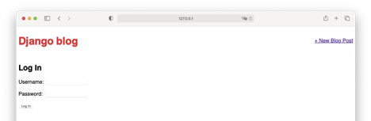
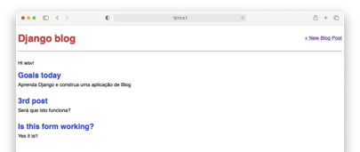
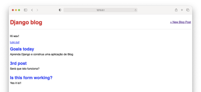
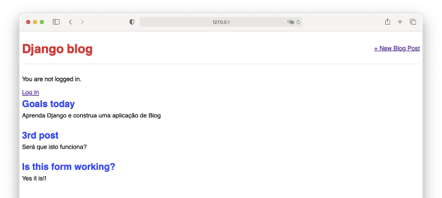
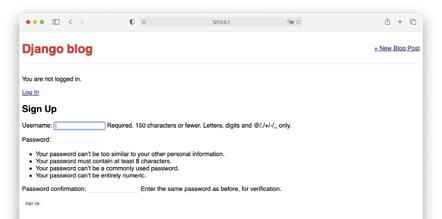
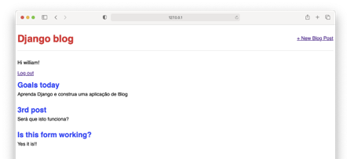

# Tutorial Django 08 – Contas de Usuário

Até agora, construímos um aplicativo de um Blog com formulários, mas estamos perdendo uma peça importante da maioria dos aplicativos da web: a autenticação do usuário.
Implementar esta autenticação de uma forma adequada é notoriamente difícil. Felizmente, o Django vem com um poderoso [sistema integrado de autenticação de usuário](https://docs.djangoproject.com/pt-br/5.0/topics/auth/ "autenticação de usuário no Django"), que podemos usar e personalizar conforme necessário.
Sempre que você cria um projeto, por padrão, o Django instala o “**app**” `auth`, que nos fornece um [`User Object`](https://docs.djangoproject.com/pt-br/5.0/ref/contrib/auth/#django.contrib.auth.models.User "User model (object)") contendo:

* `username` (nome do usuário)
* `password` (senha)
* `first_name` (primeiro nome)
* `last_name` (último nome)

Usaremos esse `User Object` para implementar *login*, *logout* e cadastramento (*sign up*) em nosso aplicativo.


Para isto, siga atentamente os passos abaixo.

**Observação Importante: somente o faça depois de fazer os tutoriais anteriores.**


## **Passo 1: Criando o link de `login`**

1.1) Abra o Terminal no VS Code. Primeiro digite (CTRL+Shift+P) e use a opção "**View: Toggle Terminal**" ou "**Ver: Alternar Terminal**".

1.2) Digite na linha de comando do Terminal:

```
cd Django_Tutoriais
cd Tutorial_06
```

1.3) Agora você precisa ativar o ambiente virtual executando o comando abaixo:

**Linux/Mac**

```
source blogenv/bin/activate
```

**Windows**

```
.\blogenv\Scripts\activate.bat
```

Ou

```
.\blogenv\Scripts\Activate.ps1
```

Você saberá que seu ambiente virtual foi ativado, porque o prompt do console no Terminal mudará. Deve ser assim:

```
(blogenv) $
```

Django nos fornece uma **“view”** padrão para uma página de login via [`LoginView`](https://docs.djangoproject.com/pt-br/5.0/topics/auth/default/#django.contrib.auth.views.LoginView "sistema de autenticação do Django - classe LoginView"). Tudo o que precisamos adicionar é um URL padrão (**URLpattern**) para o sistema de autenticação (`auth system`), um **“template”** de login e uma pequena atualização em nosso arquivo "**config/settings.py**".


1.4) Abra o arquivo “**config/urls.py**” que está na pasta **“config”** e atualize-o com o conteúdo abaixo:

```python
# config/urls.py
from django.contrib import admin 
from django.urls import path, include 

urlpatterns = [
    path('admin/', admin.site.urls),
    path('accounts/', include('django.contrib.auth.urls')),
    path('', include('blog.urls')),
] 
```

1.5) A documentação do [`LoginView`](https://docs.djangoproject.com/pt-br/5.0/topics/auth/default/#django.contrib.auth.views.LoginView "sistema de autenticação do Django - classe LoginView") diz que, por padrão, o Django irá procurar dentro do diretório chamado **“templates”**, por um outro diretório chamado **“registration”**, e dentro deste, por um arquivo chamado “**login.html**” que contém um formulário de login. Portanto, precisamos criar um diretório chamado “**registration**” e o arquivo necessário dentro dele. Caso necessário, na linha de comando, digite “CTRL+C” para sair de nosso servidor local. Em seguida, digite o seguinte:

```
(blogenv) $ mkdir blog/templates/registration
```

1.6) Agora crie um arquivo chamado “**login.html**” dentro do diretório “**templates/registration**” e adicione o código abaixo nele.

```html
<!-- templates/registration/login.html -->


 
  <h2>Log In</h2> 
  <form method="POST">
     
     {{ form.as_p }}
     <button type="submit">Log In</button>
  </form>

```

1.7) O passo final é que precisamos especificar para onde redirecionar o usuário após um login bem-sucedido. Podemos definir isso, abra o arquivo “**config/settings.py**” na pasta **“config”**, e adicione o seguinte no fim dele:

```python
# config/settings.py
LOGIN_REDIRECT_URL = 'home'
```

> Agora o usuário será redirecionado para o template **“home”** que é a nossa homepage (página principal). 


1.8) Agora, se você iniciar o servidor Django novamente com `python manage.py runserver` e navegar até nossa página de login em "http://127.0.0.1:8000/accounts/login/", você verá a figura abaixo:




> Ao inserir as informações de login de nossa conta de superusuário (`superuser`), somos redirecionados para a página inicial (i.e. ‘**homepage**’). Observe que não adicionamos nenhuma lógica em termos de “**view**” ou criamos um “**model**” de BD porque o sistema de autenticação do Django forneceu ambos para nós automaticamente. Obrigado Django!


## **Passo 2: Atualizando nossa página inicial (homepage)**

Na linha de comando, caso necessário, feche o servidor existente com “CTRL+C”. 

2.1) Vamos atualizar nosso template chamado “**base.html**” para exibir uma mensagem aos usuários, dizendo se eles estão logados ou não. Podemos usar o atributo [`is_authenticated`](https://docs.djangoproject.com/pt-br/5.0/ref/contrib/auth/#django.contrib.auth.models.User.is_authenticated "atributo de leitura") para isso. Então, atualize o conteúdo do arquivo “**templates/base.html**” que está na pasta "**templates**" com o código abaixo.

```html
<!-- templates/base.html -->
 
<html>
   <head>
      <title>Django blog</title>
      <link href="https://fonts.googleapis.com/css?family=Source+Sans+Pro:400" rel="stylesheet">
      <link href="" rel="stylesheet">
   </head> 
   <body>
      <div> 
         <header>
            <div class="nav-left">
               <h1><a href="">Django blog</a></h1>
            </div>
            <div class="nav-right">
               <a href="">+ New Blog Post</a> 
            </div>
         </header>
         
             <p>Hi {{ user.username }}!</p> 
         
             <p>You are not logged in.</p>
             <a href="">Log In</a> 
         
          
         
      </div>
    </body> 
</html>

```

> Se o usuário estiver logado, nós o cumprimentamos pelo nome dele. Caso contrário, fornecemos um link para nossa recém-criada página de login. Veja a figura abaixo.




> Observando a figura acima, vemos que funcionou!  Meu `superuser` é “**wsv**”, é isso que vejo na mensagem da página (“**Hi, wsv**”).


## **Passo 3: Criando um botão para logout**

3.1) Adicionamos a lógica no **“template”** da página para usuários não logados, mas, como fazemos o logout agora? Poderíamos ir ao painel do administrador (“**admin**” do Django) e fazer isso manualmente, mas existe uma maneira melhor. Vamos adicionar um botão de logout que redirecione para a página inicial. Graças ao sistema de autenticação do Django, isso é extremamente simples de se conseguir. Para isso, abra o arquivo “**templates/base.html**” do diretório **“templates”**, e altere o seu conteúdo pelo código abaixo.

```html
<!-- templates/base.html -->
 
<html>
   <head>
      <title>Django blog</title>
      <link href="https://fonts.googleapis.com/css?family=Source+Sans+Pro:400" rel="stylesheet">
      <link href="" rel="stylesheet">
   </head> 
   <body>
      <div> 
         <header>
            <div class="nav-left">
               <h1><a href="">Django blog</a></h1>
            </div>
            <div class="nav-right">
               <a href="">+ New Blog Post</a> 
            </div>
         </header>
         
             <p>Hi {{ user.username }}!</p>
             <form action="" method="post">
               
               <button type="submit">Logout</button>
           </form>
         
             <p>You are not logged in.</p>
             <a href="">Log In</a> 
         
          
         
      </div>
    </body> 
</html>
```

> Isso é tudo que precisamos fazer, pois a **“view”** necessária é fornecida pelo **“app”** do Django chamado “**auth**”. No entanto, precisamos especificar para onde redirecionar um usuário após o logout.


3.2) Atualize “**config/settings.py**” da pasta **“config”** para fornecer um link de redirecionamento que é chamado, apropriadamente, de `LOGOUT_REDIRECT_URL`. Podemos adicioná-lo na última linha do arquivo.

```python
# config/settings.py
LOGIN_REDIRECT_URL = 'home'
LOGOUT_REDIRECT_URL = 'home'
```

> Se você atualizar a página inicial, verá que agora tem um botão de “**Log out**” para usuários logados. Veja a figura abaixo.



E se você clicar neste botão (i.e. "**logout**"), será levado de volta à página inicial com um link de “**Log in**” (ver figura abaixo)




## **Passo 4: Criando o link de `Sign up` (i.e. para se cadastrar)**

Precisamos criar nossa própria **“view”** para uma página de “**signup**”, mas o Django nos fornece uma classe de formulário, chamada [`UserCreationForm`](https://docs.djangoproject.com/pt-br/5.0/topics/auth/default/#django.contrib.auth.forms.UserCreationForm "sistema de autenticação do Django"), para tornar as coisas mais fáceis. Por default, ela vem com três campos: nome de usuário (`username`), senha1 (`password1`) e senha2 (`password2`). Existem muitas maneiras de organizar seu código e a estrutura do URL para um sistema de autenticação de usuário robusto. 

Caso necessário, pare o servidor local com “CTRL+C”. 


4.1) Crie um **“app”**, com o nome “**accounts**”, para nossa página de “**signup**”, com o comando abaixo na linha de comando:

```
python manage.py startapp accounts
```


4.2) Abra o arquivo “**config/settings.py**” da pasta **“config”**, e adicione a linha abaixo.

```python
# config/settings.py
INSTALLED_APPS = [
    'django.contrib.admin',
    'django.contrib.auth',
    'django.contrib.contenttypes',
    'django.contrib.sessions',
    'django.contrib.messages',
    'django.contrib.staticfiles',
    'blog',
    'accounts',
]
```


4.3) Agora precisamos adicionar um novo caminho para o URL. Para isto, abra o arquivo “**config/urs.py**” da pasta **“config”**. Digite o código abaixo.

```python
# config/urls.py
from django.contrib import admin 
from django.urls import path, include
urlpatterns = [
    path('admin/', admin.site.urls),
    path('accounts/', include('django.contrib.auth.urls')),
    path('accounts/', include('accounts.urls')),
    path('', include('blog.urls')),
]
```

> Note que a ordem dos nossos URLs é importante aqui porque o Django lê esse arquivo de cima para baixo. Portanto, quando requisitamos o URL “**/accounts/signup**”, o Django primeiro procurará em **“auth”**. Porém ele não o encontrará e, em seguida, procederá para o **“app”** `accounts`.
> 
 

4.4) Crie um arquivo chamado “**urls.py**” no diretório **“accounts”**, e adicione nele o código abaixo.

```python
# accounts/urls.py
from django.urls import path 
from .views import SignUpView

urlpatterns = [
    path('signup/', SignUpView.as_view(), name='signup'),
]
```

4.5) Abra o arquivo “**accounts/views.py**” da pasta **“accounts”** e digite o código abaixo nele.

```python
# accounts/views.py
from django.contrib.auth.forms import UserCreationForm 
from django.urls import reverse_lazy
from django.views import generic

class SignUpView(generic.CreateView): 
   form_class = UserCreationForm
   success_url = reverse_lazy('login') 
   template_name = 'registration/signup.html'
```

> Estamos criando uma classe chamada `SignUpView` que é uma subclasse da **“view”** genérica `CreateView`. Especificamos o uso do `UserCreationForm` integrado e do **“template”** ainda não criado em “**signup.html**”. E usamos o método `reverse_lazy` para redirecionar o usuário para a página de login após o registro bem-sucedido.
>
> Por que usar `reverse_lazy` aqui em vez de `reverse`? O motivo é que, para todas as **“views”** genéricas baseadas em classe, os URLs não são carregados quando o arquivo é importado, então temos que usar a forma “preguiçosa” para carregá-los mais tarde, quando estiverem disponíveis.


4.6) Agora vamos criar o arquivo “**signup.html**” ao diretório “**templates/registration/**”, digitando o código abaixo nele.

```html
<!-- templates/registration/signup.html -->


 
   <h2>Sign Up</h2> 
   <form method="POST">
      
      {{ form.as_p }}
      <button type="submit">Sign Up</button>
   </form>

```

> Este formato é muito semelhante ao que fizemos antes. Estendemos nosso template “**base.html**” (início do arquivo), colocamos nossa lógica entre as tags `<form> </form>`, usamos o `csrf_token` para segurança, exibimos o conteúdo do formulário em tags de parágrafo com `form.as_p` e incluímos um botão de envio.


4.7) Agora terminamos! Para testá-lo, inicie o servidor local com `python manage.py runserver` e navegue para "http://127.0.0.1:8000/accounts/signup/". Você verá a imagem abaixo.



> Observe acima que há muito texto extra que o Django inclui por default. Podemos personalizar isso usando as [**messages framework**](https://docs.djangoproject.com/pt-br/5.0/ref/contrib/messages/ "mensagens de notificação do Django"), mas, por enquanto, experimente o formulário. Eu criei um usuário novo chamado “**william**” e após a submissão do mesmo (**Passo 4.7** **acima**), fui redirecionado para a página de login. Ver figura abaixo.



> Nosso fluxo final é, portanto: “**Signup -> Login -> Homepage**”. 
> 
> E, claro, podemos ajustar isso da maneira que quisermos. 
> 
> `SignupView` redireciona para o login porque definimos `success_url = reverse_lazy('login')`. 
> 
> A página de login redireciona para a página inicial porque em nosso arquivo “**config/settings.py**” nós definimos `LOGIN_REDIRECT_URL = 'home'`.

