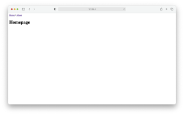

# Tutorial Django 04 – Continuando o Tutorial Django 03

Neste tutorial vamos estender o Tutorial 03 usando um conceito mais avançado de “Templates” Para isto, siga atentamente os passos abaixo.

**Observação Importante: faça isso somente depois de fazer o **Tutorial 01**, e o **Tutorial 03**.


## **Passo 1: Estendendo os Templates**

O verdadeiro poder dos “**templates**” é sua capacidade de serem estendidos. Se você pensar na maioria dos sites, existe conteúdo que se repete em todas as páginas (e.g. cabeçalho, rodapé, etc). Não seria bom se nós, como desenvolvedores, pudéssemos ter um “lugar canônico” para nosso código de cabeçalho que seria herdado por todos os outros “templates”?

Bem, nós podemos! Vamos criar um arquivo base contendo um cabeçalho com links para nossas duas páginas ("**homepage**" e "**about**"). Poderíamos chamar esse arquivo com qualquer nome, mas usar “**base.htm**l” é uma convenção padrão. Digite “CTRL+C” para encerrar a execução do servidor de desenvolvimento, caso necessário, e siga os passos abaixo.

1.1) Crie um arquivo chamado “**base.html**” na pasta “**templates**”. Dentro dele coloque o seguinte conteúdo:

```html
<!-- templates/base.html -->
<header>
   <a href="">Home</a> | 
   <a href="">About</a>
</header>



```
Django possui uma linguagem interna para trabalhar com “**templates**”. Ela serve para adicionar links e lógica básica a eles. Você pode ver a lista completa de “tags” integrados na sua  [documentação oficial](https://docs.djangoproject.com/pt-br/5.0/ref/templates/builtins/).

As tags de “**templates**” assumem a forma de `` onde esta "*alguma_coisa*" é ela própria, ou seja, a tag de “**templates**”. Você pode até criar suas próprias tags personalizadas, embora não faremos isso neste tutorial.

Para adicionar links de URL em nosso projeto, podemos usar a [tag de template de URL](https://docs.djangoproject.com/pt-br/5.0/ref/templates/builtins/#url) que leva o nome do padrão do URL como argumento. 

Você se lembra de como adicionamos os nomes dos URL opcionais aos nossos dois caminhos (rotas) em “**pages/urls.py**”? A tag URL utiliza esses nomes para criar links automaticamente para nós.

A rota do URL para nossa página inicial é chamada de “**home**”. Para configurar um link para ela, usamos a seguinte sintaxe: ``.

Observe que nas duas últimas linhas do arquivo “**templates/base.html**”, adicionamos uma tag de bloco chamada “**content**”. 

```


```

Os blocos podem ser substituídos por “**templates**” filhos por meio da herança. Embora seja opcional nomear nosso bloco de fechamento, você pode apenas escrever `` se preferir. Isso ajuda a facilitar a leitura, especialmente em arquivos de “**templates**” maiores.

Agora precisamos atualizar nossos arquivos “**home.html**” e “**about.html**” para estender o “**template**” que chamamos de “**base.html**”. Isso significa que podemos reutilizar o mesmo código de um “**template**” em outro. A linguagem de modelagem do Django vem com um método chamado ["extends"](https://docs.djangoproject.com/pt-br/5.0/ref/templates/builtins/#extends) que podemos usar para isso.


1.2) Abra o arquivo (“**templates/home.html**”) e altere o seu conteúdo para:

```html
<!-- templates/home.html -->



  <h1>Homepage</h1>
 
```


1.3) Abra o arquivo (“**templates/about.html**”) e altere o seu conteúdo para:

```python
<!-- templates/about.html -->


 
  <h1>About page</h1> 

```

1.4) 	Agora, se você iniciar o servidor com o comando `python manage.py runserver` e abrir nossas páginas da web novamente em "http://127.0.0.1:8000/" e "http://127.0.0.1:8000/about". Você verá que o cabeçalho (header) do HTML está incluído nas duas. Veja as figuras abaixo.




> Existem muito mais coisas que podemos fazer com os templates e, na prática, você normalmente criará um arquivo chamado “**base.htm**l” e, em seguida, adicionará templates (modelos) adicionais em outros projetos Django.


