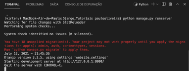
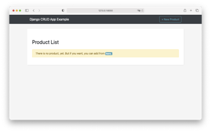
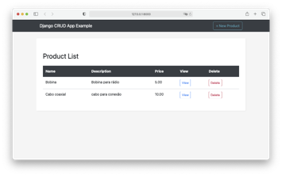

# **Tutorial Django 09 – Criando Um "**App**" com CRUD  e Bootstrap**

Neste tutorial, veremos como criar um aplicativo CRUD do zero. Também veremos como habilitar o módulo de administração (Django Admin) e criar as Views. Usaremos o Bootstrap para estilização das páginas da web. Ou seja, você aprenderá como:
* Implementar operações CRUD
* Crie as **Views**, **Templates** e **URLs** do Django
* Estilizar a UI (User Interface – Interface do Usuário) com Bootstrap 5

> **Observação Importante: somente o faça depois de fazer todos os Tutoriais anteriores**

## **Passo 1: Configure seu ambiente de desenvolvimento**

Sempre que você estiver iniciando um projeto de desenvolvimento web, é uma boa ideia configurá-lo primeiro. 

1.1) Abra o Terminal no VS Code. Primeiro digite (CTRL+Shift+P) e use a opção "**View: Toggle Terminal**" ou "**Ver: Alternar Terminal**".


1.2) Digite na linha de comando do Terminal:

```
cd Django_Tutoriais
mkdir Tutorial_09
cd Tutorial_09
```

1.3) Uma vez dentro do diretório (“**Tutorial_09**”), crie um ambiente virtual, digitando o comando a seguir:

```
python3 -m venv prodenv
````

Caso esteja usando o Windows:

```   
py -m venv prodenv
```

1.4) Agora você precisa ativar o ambiente virtual criado no item anterior, executando o comando abaixo, de acordo com o seu Sistema Operacional:

**Linux/Mac**

```
source prodenv/bin/activate
````

**Windows**

```
.\prodenv\Scripts\activate.bat
````

Ou

```
.\prodenv\Scripts\Activate.ps1
```


Você saberá que seu ambiente virtual foi ativado, porque o prompt do console no Terminal mudará. Deve ser assim:

```
(prodenv) $
```

1.5) Agora que você criou um ambiente virtual, é hora de instalar o Django. Digite na linha de comando:

```
(prodenv) $ pip install django
```


## **Passo 2: Criando seu projeto em Django**

2.1) Certifique-se de que você está dentro do diretório “**Tutorial_09**” e o ambiente virtual ativado. Agora, digite o comando abaixo para criar um projeto.

```
(prodenv) $ django-admin startproject config .
```

> **Observação: ao criar um novo projeto Django chamado **“config”** certifique-se de incluir o ponto (.) no final do comando para que ele seja instalado no diretório atual.**


2.2) Agora, na linha de comando do Terminal, digite o seguinte comando:

```
python manage.py migrate
```


> Você verá uma série de mensagens no Terminal. Não se preocupe. Na verdade, o comando acima aplica um conjunto de migrações internas para criar algumas tabelas do Banco de Dados necessárias para o funcionamento do Django.


## **Passo 3: Testando seu servidor Django**

3.1) Depois que sua estrutura de arquivos estiver configurada, você pode iniciar o servidor de desenvolvimento que já vem embutido no Django. Para verificar se a configuração foi bem-sucedida, execute o seguinte comando no console do Terminal:

```
python manage.py runserver
```


3.2)  Observe no console do Terminal as mensagens da figura abaixo:



Ao posicionar o mouse no link "http://127.0.0.1:8000/" você verá a seguinte mensagem:


No Windows irá aparecer "**Seguir o link (ctrl + click)**". Ao efetuar esta operação, você será direcionado para uma aba do seu browser, e, se tudo estiver correto, você verá uma página da web como a da figura abaixo.


3.3) Parabéns, você acabou de criar um projeto, nossa configuração está correta e você o testou no servidor de desenvolvimento. Agora o Django está pronto para começarmos a desenvolver.


## **Passo 4: Criando o Usuário `Admin`**

4.1) Para usar o Django **“admin”**, primeiro precisamos criar um super usuário (`superuser`) que possa fazer login. No console da linha de comando, digite o comando abaixo e responda aos prompts de nome de usuário (`Username`), e-mail (`Email`) e senha (`Password`):

```
python manage.py createsuperuser
```

Os prompts estão descritos abaixo. Os valores digitados (em destaque) são ilustrativos. Escolha o mais adequado ao seu caso:

```
Username (leave blank to use 'wsv'): admin
Email: admin@meusite.com.br
Password:
Password (again):
Superuser created successfully.
```

> **Observação importante: Ao digitar sua senha, ela não aparecerá visível no console da linha de comando por motivos de segurança.**


## **Passo 5: Criando uma aplicação em Django**

5.1) Para criar uma **“app”**, execute o seguinte comando:

```
python manage.py startapp products
```

5.2) Agora que você criou a **“app”**, temos que “instalá-la” no seu projeto. Abra o arquivo ("**config/settings.py**") e adicione a última linha de código em `INSTALLED_APPS`: (**Não se esqueça de colocar a vírgula após a string**).


```python
INSTALLED_APPS = [
    'django.contrib.admin',
    'django.contrib.auth',
    'django.contrib.contenttypes',
    'django.contrib.sessions',
    'django.contrib.messages',
    'django.contrib.staticfiles',
    'products',
```

## **Passo 6: Criando os Models**

6.1) Agora, abra o arquivo "**products/models.py**", e adicione o código abaixo.

```python
# products/models.py
from django.db import models

class Product(models.Model):
    name = models.CharField('Name', max_length=100)
    description = models.TextField('Description', blank=True)
    price = models.DecimalField('Price', decimal_places=2, max_digits=8)
    created = models.DateTimeField('Created', auto_now_add=True)
    changed = models.DateTimeField('Changed', auto_now=True)

    class Meta:
        ordering = ['name']

    def __str__(self):
        return self.name
        
    def get_absolute_url(self):
        return reverse('product_edit', kwargs={'pk': self.pk})
```

6.2) Precisamos agora executar o seguinte comando:

```
python manage.py makemigrations
```

6.3) Agora você precisa migrar seu BD usando o comando abaixo:

```
python manage.py migrate
```

## **Passo 7: Criando um Formulário (Form)**

7.1) Crie um arquivo chamado "forms.py" no diretório (“**products/forms.py**”). Dentro dele   adicione o código abaixo.

```python
from django import forms
from .models import Product

class ProductForm(forms.ModelForm):
    def __init__(self, *args, **kwargs):
        super(ProductForm, self).__init__(*args, **kwargs)
        self.fields['name'].widget.attrs = {
            'class': 'form-control col-md-6'
        }
        self.fields['description'].widget.attrs = {
            'class': 'form-control col-md-6'
        }
        self.fields['price'].widget.attrs = {
            'class': 'form-control col-md-6',
            'step': 'any',
            'min': '1',
        }

    class Meta:
        model = Product
        fields = ('name', 'description', 'price')
```

Precisamos compreender o código acima. A explicação segue abaixo.

### Explicação do Código Python em Português

O código Python fornecido define um formulário Django para gerenciar dados de produtos. Vamos analisar cada parte em detalhes:

**Importações:**

- `from django import forms`: Importa o módulo `forms` do framework Django. Esse módulo fornece ferramentas para criar e manipular formulários HTML em aplicativos web Django.

**Definição da Classe:**

- `class ProductForm(forms.ModelForm):`: Define uma classe chamada `ProductForm` que herda de `forms.ModelForm`. `ModelForm` é uma classe de formulário especializada no Django que simplifica o processo de criação de formulários baseados em modelos de banco de dados existentes.

**Método `__init__`:**

- `def __init__(self, *args, **kwargs):`: Este é o método construtor da classe `ProductForm`. É chamado sempre que uma nova instância deste formulário é criada.
  - `super(ProductForm, self).__init__(*args, **kwargs)`: Chama o construtor da classe pai (`forms.ModelForm`) para garantir a inicialização adequada. Ele passa quaisquer argumentos (`*args`) e argumentos de palavra-chave (`**kwargs`) recebidos ao criar a instância do formulário.
  - `self.fields['name'].widget.attrs = {'class': 'form-control col-md-6'}`: Esta linha modifica os atributos do `widget` associado ao campo `name` no formulário. Veja o que está acontecendo:
      - `self.fields['name']`: Acessa o campo `name` no dicionário `fields` do formulário.
      - `.widget`: Obtém o objeto widget associado ao campo. Os widgets determinam como o campo é renderizado no formulário HTML.
      - `.attrs`: Refere-se a um dicionário que contém atributos HTML para o elemento de entrada do widget.
      - `{'class': 'form-control col-md-6'}`: Define o atributo `class` para o valor `'form-control col-md-6'`. Isso provavelmente aplica classes CSS Bootstrap para estilizar o campo de entrada (por exemplo, torná-lo uma entrada de texto com uma largura específica).
  - Linhas semelhantes são usadas para modificar os atributos dos campos `description` e `price`, provavelmente aplicando as mesmas classes Bootstrap (`'form-control col-md-6'`) e atributos adicionais:
      - `'step': 'any'`: Este atributo pode ser usado para permitir que os usuários insiram valores decimais para o preço (dependendo do tipo de entrada HTML).
      - `'min': '1'`: Este atributo define um valor mínimo de 1 para o campo de preço.

**Classe `Meta`:**

- `class Meta:`: Esta classe interna dentro de `ProductForm` fornece opções de configuração adicionais para o formulário.
  - `model = Product`: Especifica que este formulário é baseado no modelo `Product`. Quando você cria uma instância `ProductForm`, ela mapeia automaticamente seus campos para os campos correspondentes no modelo `Product`.
  - `fields = ('name', 'description', 'price')`: Indica que o formulário deve incluir os campos `name`, `description` e `price` do modelo `Product`. Você pode usar isso para controlar quais campos aparecem no formulário.

**Resumo:**

Este código define um formulário Django chamado `ProductForm` que é projetado especificamente para trabalhar com o modelo `Product`. Ele permite que você crie formulários HTML para criar ou editar dados de produtos, com classes CSS Bootstrap potencialmente aplicadas para estilização. O método `__init__` personaliza a aparência dos campos do formulário usando atributos do widget.


## **Passo 8: Criando as Views**

Neste passo, criaremos as visualizações (“Views”) para realizar as operações CRUD. 

8.1) Abra o arquivo "**views.py**" no diretório (“**products/views.py**”). Substitua o conteúdo dele pelo código abaixo.


```python
from django.shortcuts import render
from django.views.generic import ListView, DetailView 
from django.contrib.messages.views import SuccessMessageMixin
from django.views.generic.edit import CreateView, UpdateView, DeleteView
from django.http import HttpResponse
from django.urls import reverse_lazy

from .models import Product
from .forms import ProductForm

class ProductList(ListView): 
    model = Product

class ProductDetail(DetailView): 
    model = Product

class ProductCreate(SuccessMessageMixin, CreateView): 
    model = Product
    form_class = ProductForm
    success_url = reverse_lazy('product_list')
    success_message = "Product successfully created!"

class ProductUpdate(SuccessMessageMixin, UpdateView): 
    model = Product
    form_class = ProductForm
    success_url = reverse_lazy('product_list')
    success_message = "Product successfully updated!"

class ProductDelete(SuccessMessageMixin, DeleteView):
    model = Product
    success_url = reverse_lazy('product_list')
    success_message = "Product successfully deleted!"
```

## **Passo 9: Criando os Templates**

9.1) Abra o arquivo (“**config/settings.py**”) e adicione a seguinte linha de código que trata do `DIRS` destacada em TEMPLATES.

```python
TEMPLATES = [
    {
   'BACKEND': 'django.template.backends.django.DjangoTemplates',
   'DIRS': [str(BASE_DIR.joinpath('templates'))],        
   'APP_DIRS': True,
         'OPTIONS': {
            'context_processors': [
                'django.template.context_processors.debug',
                'django.template.context_processors.request',
                'django.contrib.auth.context_processors.auth',
                'django.contrib.messages.context_processors.messages',
            ],
        },
    },
]
```

Caso o seu servidor de desenvolvimento está sendo executado, digite “CTRL+C” para pará-lo.

9.2) Na linha de comando execute os comandos abaixo.

```
cd products
mkdir templates
cd templates
mkdir products
```

9.3) Dentro da pasta “**templates/products**”, crie o arquivo “**base.html**” e adicione o código abaixo nele.

```html

<!DOCTYPE html>
<html lang="en">
  <head>
    <meta charset="utf-8">
    <meta name="viewport" content="width=device-width, initial-scale=1, shrink-to-fit=no">
    <title>Django CRUD App Example</title>
    <!-- Bootstrap core CSS -->
    <link href="" rel="stylesheet">
    <link href="" rel="stylesheet">
  </head>
  <body>

    <!-- Navigation -->
    <nav class="navbar navbar-expand-lg navbar-dark bg-dark">
      <div class="container">
        <a class="navbar-brand" href="/">Django CRUD App Example</a>
        <button class="navbar-toggler" type="button" data-toggle="collapse" data-target="#navbarResponsive" aria-controls="navbarResponsive" aria-expanded="false" aria-label="Toggle navigation">
          <span class="navbar-toggler-icon"></span>
        </button>
        <div class="collapse navbar-collapse" id="navbarResponsive">
          <ul class="navbar-nav ml-auto">
            <li class="nav-item">
              <a class="btn btn-outline-info btn-md" href="">+ New Product</a>
            </li>
          </ul>
        </div>
      </div>
    </nav>

    <!-- Page Content -->
    <div class="container" id="app">
        
        
    </div>
    <!-- /.container -->

    <!-- Bootstrap core JavaScript -->
    <script src=""></script>
    <script src=""></script>
  </body>
</html>
```

9.4) Dentro da pasta “**templates/products**”, crie o arquivo "**product_form.html**" e adicione o código abaixo nele.

```html



    <h1 class="my-4"> New Product  Edit - 
        <small>{{ product.name }}</small>
    </h1>
    <div class="row">
        <div class="col-12">
            <form method="POST">
                
                
                    <div class="form-group">
                        {{ field.label_tag }}
                        {{ field }}
                    </div>
                
                <input type="submit"  value="Add"  value="Update"  class="btn btn-success"/>
                <a href=""><button type="button" class="btn btn-secondary">Back</button></a>
            </form>
        </div>
    </div>

```

9.5) Dentro da pasta “**templates/products**”, crie o arquivo “**product_detail.html**” e adicione o código abaixo nele.

```html



    <h1 class="my-4">Detail -
        <small>{{ object.name }}</small>
    </h1>
    <div class="row">
        <div class="col-12">
            <ul class="list-group">
              <li class="list-group-item"><strong>Name:</strong> {{ object.name }}</li>
              <li class="list-group-item"><strong>Description:</strong> {{ object.description }}</li>
              <li class="list-group-item"><strong>Price:</strong> {{ object.price }}</li>
            </ul>
        </div>
    </div>

    <div class="row top-buffer">
        <div class="col-12">
                <a href=""><button type="button" class="btn btn-success">Edit</button></a>
                <a href=""><button type="button" class="btn btn-secondary">Back</button></a>
        </div>
    </div>

```


9.6) Dentro da pasta “**templates/products**”, crie o arquivo “**product_list.html**” e adicione o código abaixo nele.

```html



    <h1 class="my-4">
        <small>Product List</small>
    </h1>
    
        
            <div class="alert alert-success" role="alert">
                {{ message }}
            </div>
        
    
    <div class="row">
    
        <div class="col-12" style="overflow-x: scroll">
            <table class="table">
              <thead class="thead-dark">
                <tr>
                    <th scope="col">Name</th>
                    <th scope="col">Description</th>
                    <th scope="col">Price</th>
                    <th scope="col">View</th>
                    <th scope="col">Delete</th>
                </tr>
              </thead>
              <tbody>
                
                <tr>
                    <td>{{ product.name }}</td>
                    <td>{{ product.description }}</td>
                    <td>{{ product.price }}</td>
                    <td><a href=""><button type="button" class="btn btn-outline-primary btn-sm">View</button></a></td>
                    <td><a href=""><button type="button" class="btn btn-outline-danger btn-sm">Delete</button></a></td>
                </tr>
                
              </tbody>
            </table>
        </div>
    
    <div class="col-12">
        <div class="alert alert-warning" role="alert">
            There is no product, yet. But if you want, you can add from <a class="badge badge-info" href=""><strong>here.</strong></a>
        </div>
    </div>
    
    </div>

```

9.7) Dentro da pasta “**templates/products**”, crie o arquivo “**product_confirm_delete.html**” e adicione o código abaixo nele.

```html



    <h1 class="my-4">Delete -
        <small>{{ object }}</small>
    </h1>
    <div class="row">
        <div class="col-12">
            <form method="POST">
                
                <div class="alert alert-warning" role="alert">
                  Are you sure to delete {{ object }} ?
                </div>
                <input type="submit" class="btn btn-info" value="Yes, delete it" />
                <a class="btn btn-success" href="">No, just I've tried the delete button</a>
            </form>
        </div>
    </div>

```

## **Passo 10: Trabalhando com Arquivos Estáticos**

Precisamos adicionar algum CSS ao nosso projeto para melhorar o estilo dele. CSS, JavaScript e imagens são a peça central de qualquer aplicativo da web moderno e, no mundo do Django, são chamados de "arquivos estáticos – static files". O Django oferece uma enorme flexibilidade em torno de como esses arquivos são usados, mas isso pode causar muita confusão para os iniciantes.

Por default, o Django irá procurar dentro de cada **“app”** por uma pasta (diretório) chamada **“static”**. Em outras palavras, um diretório chamado “**products/static/**”. Se você se lembra, isso é semelhante a como os “templates” também são tratados.

Como os projetos Django crescem em complexidade com o tempo e têm vários **“apps”**, geralmente é mais simples raciocinar sobre os arquivos estáticos se eles estiverem armazenados em um único diretório em nível de projeto. Essa é a abordagem que vamos usar.

10.1) Caso necessário, saia do servidor local com “CTRL+C” e crie um diretório chamado **“static”** na mesma pasta onde está o arquivo “**manage.py**”, ou seja, a pasta é “**Tutorial_09**”. Para isto, na linha de comando digite o comando abaixo:

```
(prodenv) $ mkdir static
```

10.2) Abra o arquivo “**config/settings.py**”. Observe que no fim deste arquivo você encontra uma linha de configuração:

```python
# config/settings.py
STATIC_URL = '/static/'
```


[`STATIC_URL`](https://docs.djangoproject.com/pt-br/5.0/ref/settings/#std:setting-STATIC_URL "URL para arquivos estáticos") é a localização do URL dos arquivos estáticos em nosso projeto, também conhecidos como “**/static/**”.

Configurando [`STATICFILES_DIRS`](https://docs.djangoproject.com/pt-br/5.0/ref/settings/#staticfiles-dirs "Define localizações adicionais "), podemos dizer ao Django onde procurar por arquivos. 

10.3) Agora, no arquivo “**config/settings.py**”, adicione a linha abaixo a qual diz ao Django para procurar pela nossa recém-criada pasta **“static”** (**Passo 10.1**).

```python
# config/settings.py
STATIC_URL = '/static/'
STATICFILES_DIRS = [str(BASE_DIR.joinpath('static'))]
```

10.4) Faça o download do Bootstrap neste link:

[Download Bootstrap](https://github.com/twbs/bootstrap/releases/download/v5.3.3/bootstrap-5.3.3-dist.zip "Download Bootstrap - v5.3")

Descompacte o arquivo. Você verá uma pasta chamada “**bootstrap-5.3.3-dist**” que contém duas subpastas dentro dela: **“css”** e **“js”**. Copie-as para o diretório **“static”** que você criou no **Passo 10.1**.


10.5) Crie um arquivo chamado “**style.css**” dentro da pasta “**static/css/style.css**”, e digite o seguinte código:

```css
/* static/css/style.css */
body {
    background: whitesmoke
}
#app {
    background: white;
    padding: 30px;
    margin: 30px auto;
    -webkit-box-shadow: 1px 1px 2px 0px rgba(224,224,224,1);
    -moz-box-shadow: 1px 1px 2px 0px rgba(224,224,224,1);
    box-shadow: 1px 1px 2px 0px rgba(224,224,224,1);
    border-radius: 4px;
}
.top-buffer { margin-top:20px; }
```

## **Passo 11: Criando os URLs**

11.1) Dentro da pasta **“config”**, abra o arquivo “**config/urls.py**” e adicione o código abaixo nele.

```python
from django.contrib import admin
from django.urls import path, include

urlpatterns = [
    path('admin/', admin.site.urls),
    path('', include('products.urls')),
]
```


11.2) Dentro da pasta **“products”**, crie o arquivo “**products/urls.py**” e adicione o código abaixo nele.

```python
from django.urls import path
from products import views

urlpatterns = [
    path('', views.ProductList.as_view(), name='product_list'),
    path('view/<int:pk>', views.ProductDetail.as_view(), name='product_view'),
    path('new', views.ProductCreate.as_view(), name='product_new'),
    path('edit/<int:pk>', views.ProductUpdate.as_view(), name='product_edit'),
    path('delete/<int:pk>', views.ProductDelete.as_view(), name='product_delete'),
]
```

11.3) Agora, ao reiniciar o servidor no Terminal `python manage.py runserver`, visite "http://127.0.0.1:8000". Você deverá a seguinte página da web:

)


Como você está rodando a aplicação Django pela primeira vez, ela indicará que não existe produtos cadastrados ainda. Clique no botão `+ New Product` para inserir. Se a tabela de produtos possui registros, a tela que você verá será a que está na figura abaixo.

)

