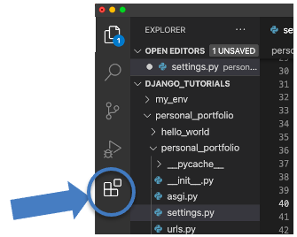
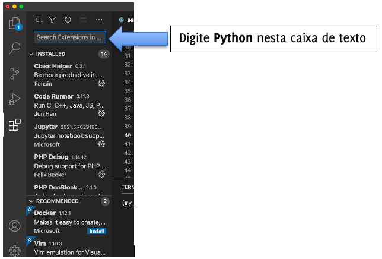
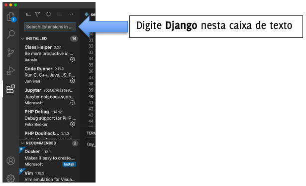
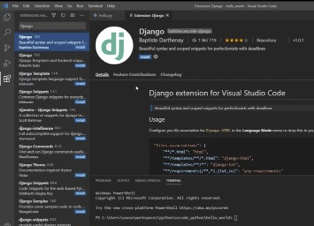

# Tutorial Django 01 – Instalando e Configurando o Visual Studio Code

Neste tutorial, você aprenderá a instalar e configurar o Visual Studio Code (VS Code) para trabalhar com Django. Para isto, siga os passos abaixo.

Antes de prosseguir, caso não tenha instalado o Python em seu computador, siga as instruções abaixo, de acordo com o Sistema Operacional da sua máquina. 
> **Observação: procure instalar a última versão.**

1)	[Intalação Windows](https://python.org.br/instalacao-windows/)
2)	[Intalação Linux](https://python.org.br/instalacao-linux/)
3)	[Instalação MacOS](https://python.org.br/instalacao-mac/)


> **Observação Importante: caso você já tenha instalado o VS Code, pule para o passo 2.**

## **Passo 1: Instalar o Visual Studio Code**

a) Faça o download do VS Code neste link:
https://code.visualstudio.com/Download

b) Escolha o Sistema Operacional de acordo com sua máquina

c) Clique no arquivo baixado para efetuar a instalação

d) Após a instalação do aplicativo, clique duas vezes para abri-lo


## **Passo 2: Instalar extensões para trabalhar com Python e Django no Visual Studio Code**

2.1) Clique no ícone da figura abaixo que fica no lado esquerdo (Barra de Atividades). Ele faz o gerenciamento das extensões.




2.2) Você irá visualizar uma lista das extensões mais populares do VS Code.




2.3) Após digitar **“Python”** na caixa de texto, você verá uma lista de várias extensões Python. Clique na primeira opção. Depois, clique no botão azul **“Install”** (**“Instalar”**). Quando a instalação estiver completa, o botão **“Install”** irá mudar para o botão **“Uninstall”** (**“Desinstalar”**). Pode aparecer também o botão **“Disable”** (**“Desabilitar”**).


2.4) Agora você vai instalar a extensão Django.




2.5) Após digitar **“Django”** na caixa de texto, você verá uma lista de várias extensões (ver figura abaixo). Clique na primeira opção. Depois, clique no botão azul **“Install”** (**“Instalar”**). Quando a instalação estiver completa, o botão **“Install”** irá mudar para o botão **“Uninstall”** (**“Desinstalar”**). Pode aparecer também o botão **“Disable”** (**“Desabilitar”**).




## **Passo 3: Preparando seu ambiente de desenvolvimento**

Sempre que você estiver trabalhando com desenvolvimento web, é uma boa ideia configurá-lo primeiro. 

3.1) Abra o Terminal no VS Code. Primeiro digite (CTRL+Shift+P) e use a opção “**View: Toggle Terminal**”

3.2) Digite na linha de comando do Terminal:

```
mkdir Django_Tutoriais
cd Django_Tutoriais
````

> **A pasta que você criou acima conterá todos os seus projetos da disciplina. O nome dela é apenas sugestivo, porém, altere, caso deseje.**
