# Tutorial Django 07 – Adicionando Formulários Na Aplicação Web (Blog)

Vamos continuar trabalhando em nosso aplicativo de Blog desenvolvido no tutorial anterior (**Tutorial Django 06**), adicionando formulários para que um usuário possa **criar**, **editar** ou **excluir** qualquer uma de suas entradas do Blog, a qual é geralmente referida como um **CRUD**. A sigla **CRUD** vem de **Create**, **Read**, **Update**, **Delete**, que são as quatro operações básicas que o usuário pode realizar sobre os dados. Em Django, essas funcionalidades são comumente implementadas usando o Django admin ou através de formulários e **Views** que manipulam os modelos de dados.

Para isto, siga atentamente os passos abaixo.

**Observação Importante: faça isso somente depois de fazer o Tutorial 01, que trata da instalação do Python e Visual Studio Code e o Tutorial 06.**


## **Passo 1: Criando Formulários**

Os formulários ("**Forms**") são uma parte onipresente da web moderna, mas são muito complicados de implementar corretamente. Sempre que você aceita uma entrada do usuário, existem questões de segurança (e.g. [Ataques XSS](https://pt.wikipedia.org/wiki/Cross-site_scripting "XSS - Cross-site scripting")), o tratamento de erros adequado é necessário e considerações em termos de interface sobre como alertar este usuário sobre problemas.

Felizmente para nós, os [Formulários Integrados](https://docs.djangoproject.com/pt-br/5.0/topics/forms/ "Trabalhando com formulários") do Django abstraem grande parte da dificuldade e fornecem um rico conjunto de ferramentas para lidar com casos de uso comuns trabalhando com eles.


1.1) Abra o Terminal no VS Code. Primeiro digite (CTRL+Shift+P) e use a opção "**View: Toggle Terminal**" ou "**Ver: Alternar Terminal**".

1.2) Digite na linha de comando do Terminal:

```
cd Django_Tutoriais
cd Tutorial_06
```

1.3) Agora você precisa ativar o ambiente virtual executando o comando abaixo:

**Linux/Mac**

```
source blogenv/bin/activate
```

**Windows**

```
.\blogenv\Scripts\activate.bat
```

Ou

```
.\blogenv\Scripts\Activate.ps1
```

Você saberá que seu ambiente virtual foi ativado, porque o prompt do console no Terminal mudará. Deve ser assim:

```
(blogenv) $
```

1.4) Agora atualize nosso “**template**” básico para exibir um link para uma página para inserir novas postagens do Blog. Para isto, abra o arquivo "**templates/base.html**" que está na pasta “**templates**” e atualize-o com o conteúdo abaixo:

```html
<!-- templates/base.html -->
 
<html>
   <head>
      <title>Django blog</title>
      <link href="https://fonts.googleapis.com/css?family=\ Source+Sans+Pro:400" rel="stylesheet">
      <link href="" rel="stylesheet">
   </head> 
   <body>
      <div> 
         <header>
           <div class="nav-left">
              <h1><a href="">Django blog</a></h1>
           </div>
           <div class="nav-right">
               <a href="">+ New Blog Post</a>
           </div>
         </header>
          
         
      </div> 
   </body>
</html>
```


## **Passo 2: Criando nossas Views/Templates/URLs**

Na linha de comando, caso necessário, feche o servidor existente com “CTRL+C”. 

2.1) Aba o arquivo na pasta “**blog**” chamado “**blog/urls.py**”. Altere o seu conteúdo pelo código abaixo.

```python
from django.urls import path
from .views import BlogListView, BlogDetailView, BlogCreateView

urlpatterns = [
    path('', BlogListView.as_view(), name='home'),
    path('post/<int:pk>/', BlogDetailView.as_view(), name='post_detail'),
    path('post/new/', BlogCreateView.as_view(), name='post_new'),
]
```


2.2) Agora vamos criar nossa “**View**” importando uma nova classe genérica chamada `CreateView` na primeira linha de código e então criar uma outra chamada `BlogCreateView` que irá herdá-la. Abra o arquivo “**blog/views.py**” que está na pasta “**blog**” e altere todo o código contido nele pelo indicado abaixo.

```python
# blog/views.py
from django.views.generic import ListView, DetailView 
from django.views.generic.edit import CreateView
from .models import Post 

class BlogListView(ListView): 
	model = Post 
	template_name = 'home.html'

class BlogDetailView(DetailView): 
	model = Post 
	template_name = 'post_detail.html'

class BlogCreateView(CreateView):
	model = Post 
	template_name = 'post_new.html'
	fields = ['title', 'author', 'body']
```

> Em `BlogCreateView`, especificamos nosso “**model**” de BD, que é “**Post**”, e o nome de nosso “template” – “**post_new.html**”. Para os campos, definimos explicitamente quais os que queremos exibir, que são “**title**”, “**author**” e “**body**“.


2.3) O último passo é criar nosso “**template**”, que chamaremos de “**post_new.html**”. Para isto, crie um arquivo com este nome na pasta “**templates**”, e adicione o código abaixo.

```html
<!-- templates/post_new.html -->


   <h1>New post</h1>
   <form action="" method="POST"> 
      {{ form.as_p }}
      <input type="submit" value="Save"> 
   </form> 

```

Vamos analisar o que fizemos no passo acima:

* Na primeira linha do código “**post_new.html**” herda do “**template**” básico “**base.html**”.
* Usamos o elemento HTML `<form>` com o método POST, pois estamos enviando dados. Se estivéssemos recebendo dados de um formulário, por exemplo em uma caixa de pesquisa, usaríamos **GET**.
* Adicionamos um [``](https://docs.djangoproject.com/pt-br/5.0/ref/csrf/ "Cross Site Request Forgery protection") que o Django fornece para proteger nosso formulário de um tipo de ataque chamado “**Cross-Site Request Forgery (Falsificação de solicitação entre sites)**”. Você deve usá-lo para todos os seus formulários quando estiver usando o Django.
* Para gerar nossas entradas de formulário, usamos `{{form.as_p}}` que os renderiza dentro de tags `<p>` do HTML. 
* Finalmente, especificamos um elemento “**input**” do tipo “**submit**” e atribuímos a ele o valor “**Save**”.


2.4) Para visualizar nosso trabalho, inicie o servidor com `python manage.py runserver` e vá para a página inicial em "http://127.0.0.1:8000/". Você irá visualizar a página abaixo.

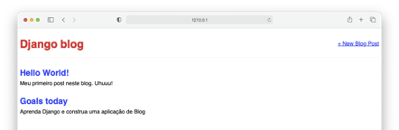


2.5) Clique no link “**+ New Blog Post**” no canto superior direito. Ele irá redirecionar para a página da web em "http://127.0.0.1:8000/post/new/". Veja a figura abaixo.

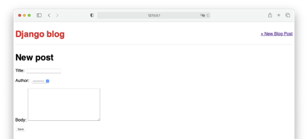


Agora tente criar uma postagem nova (ver figura abaixo) no Blog e pressione o botão “**Save**”.

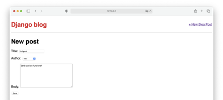

Ao clicar no botão “**Save**”, algo estranho acontece. Veja a figura abaixo.

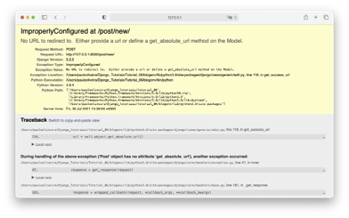


> A mensagem de erro acima é bastante útil. O Django está reclamando que não especificamos para onde devíamos submeter o formulário com sucesso. A mensagem é esta:
“**No URL to redirect to. Either provide a url of define a `get_absolute_url` method on the Model**”. 

> O motivo da mensagem acima é porque não definimos nada no atributo “**action**” do elemento `<form>` no **Passo 2.3**. Ou seja, precisamos enviar o usuário para a página de detalhes após ter pressionado o botão “**Save**”. Com isto, ele pode ver a postagem concluída.

> Podemos seguir a sugestão do Django e adicionar o método [`get_absolute_url`](https://docs.djangoproject.com/pt-br/5.0/ref/models/instances/#django.db.models.Model.get_absolute_url "Método get_absolute_url") ao nosso “**model**”. Esta é uma prática recomendada que você deve sempre fazer. Este método define um URL canônico para um objeto. Portanto, mesmo que a estrutura de seus URLs mude no futuro, a referência ao objeto específico é a mesma. Resumindo, você deve adicionar os métodos `get_absolute_url()` e `__str__()` a cada “**model**” que você escrever.


Na linha de comando, caso necessário, feche o servidor existente com "CTRL+C".


2.6) Para isto, abra o arquivo “**blog/models.py**” que está na pasta “**blog**”. Substitua o seu conteúdo com o que está abaixo. 

```python
# blog/models.py
from django.db import models
from django.urls import reverse

class Post(models.Model):
	title = models.CharField(max_length=200) 
	author = models.ForeignKey(
        'auth.User',
        on_delete=models.CASCADE,
      )
	body = models.TextField() 

	def __str__(self):
   	   return self.title

	def get_absolute_url(self):
           return reverse('post_detail', args=[str(self.id)])
```

> `reverse` é uma função utilitária muito útil que o Django nos fornece para referenciar um objeto pelo seu nome de “**template**” de URL, que, neste caso é “**post_detail**”. Se você se lembra, o nome do nosso padrão de URL é o seguinte (ver **Passo 10.3 do Tutorial 06**):

```python
# blog/urls.py
path('post/<int:pk>/', BlogDetailView.as_view(), name='post_detail'),
```


> Para que essa rota funcione, também devemos passar um argumento com o `pk` (*primary key* – **chave primária**) do objeto. Porém, confusamente, `pk` e `id` são intercambiáveis no Django, embora sua documentação recomende o uso de `self.id` com o método `get_absolute_url`. 
> 
> Em outras palavras, estamos dizendo ao Django que a localização final de uma entrada “**Post**” é sua “**View**” “**post_detail**”, que é `post/<int:pk>/`. Isto quer dizer que a rota para a primeira entrada que fizemos estará em `post/1`.


2.7) Para criar uma postagem nova para nosso Blog, ative o servidor com o comando `python manage.py runserver`, e vá para "http://127.0.0.1:8000/post/new". Você verá a página abaixo.


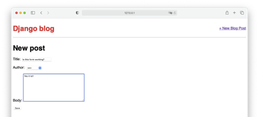

> Ao clicar no botão “**Save**”, você agora será redirecionado para a página de visualização detalhada da postagem (ver figura abaixo). Observe o URL na linha de endereço do browser (i.e. "http://127.0.0.1:8000/post/4").


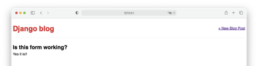


2.8) Agora vá para a página inicial em "http://127.0.0.1:8000/". Note que a postagem que acabamos de criar para nosso Blog também está lá. Ou seja, ela foi enviada com sucesso para o Banco de Dados, mas o Django não soube como nos redirecionar para esta "**homepage**" depois disso (ver figura abaixo).

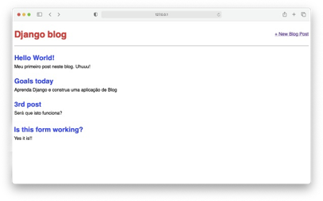

Na linha de comando, caso necessário, feche o servidor existente com "CTRL+C". 


## **Passo 3: Criando um Formulário de Atualização (Update)**

O processo de criação de um formulário de atualização para que os usuários possam editar as postagens do Blog deve parecer familiar. Mais uma vez, usaremos uma visão genérica baseada em classe do Django, chamada [`UpdateView`](https://docs.djangoproject.com/pt-br/5.0/ref/class-based-views/generic-editing/#django.views.generic.edit.UpdateView "Views de edição genérica - Update"), e criaremos o “**template**”, “**url**” e “**view**” necessários.

Para começar, vamos adicionar um novo link para “post_detail.html” para que a opção de editar uma postagem do Blog apareça em uma página individual dele.

3.1) Abra o arquivo “**templates/post_detail.html**” que está na pasta “**templates**”. Substitua todo o seu conteúdo pelo o que está abaixo.

```html
<!-- templates/post_detail.html -->



   <div class="post-entry">
      <h2>{{ post.title }}</h2>
      <p>{{ post.body }}</p> 
   </div>

   <p><a href="">+ Edit Blog Post</a></p>

```

> O que fizemos acima foi adicionar um link usando o elemento HTML `<a href> ... </a>` e a tag do mecanismo de “**templates**” do Django, que é ``. Dentro do elemento, especificamos o nome de destino do nosso URL, que será chamado de “**post_edit**” e também passamos o parâmetro necessário, que é a chave primária do post (`post.pk`).


3.2) Em seguida, precisamos criar um “**template**” para nossa página de edição chamada “**post_edit.html**”. Para isto, crie um arquivo chamado “**post_edit.html**” no diretório “**templates**”. Dentro dele adicione o código abaixo.

```html
<!-- templates/post_edit.html -->



   <h1>Edit post</h1>
   <form action="" method="POST">
      {{ form.as_p }}
      <input type="submit" value="Update">
   </form>

```

> Novamente usamos elementos HTML `<form>` e `</form>`, e `csrf_token` do Django para segurança, e `form.as_p` para exibir nossos campos de formulário com tags de parágrafo e, finalmente, atribuímos o valor "**Update**" (**Atualizar**) no botão de submissão do formulário.


3.3) Agora precisamos atualizar nossa “**View**”. Abra o arquivo “**blog/views.py**” que está no diretório “**blog**” e atualize todo o seu conteúdo pelo código abaixo.

```python
# blog/views.py
from django.views.generic import ListView, DetailView
from django.views.generic.edit import CreateView, UpdateView
from .models import Post

class BlogListView(ListView):
    model = Post
    template_name = 'home.html'

class BlogDetailView(DetailView):
    model = Post
    template_name = 'post_detail.html'

class BlogCreateView(CreateView):
    model = Post
    template_name = 'post_new.html'
    fields = ['title', 'author', 'body']

class BlogUpdateView(UpdateView): 
    model = Post
    template_name = 'post_edit.html'
    fields = ['title', 'body']
```


3.4) Agora precisamos atualizar nosso URL. Abra o arquivo “**blog/urls.py**” na pasta “**blog**” e altere o seu conteúdo inserindo o código abaixo.

```python
# blog/urls.py
from django.urls import path 
from .views import (
    BlogListView,
    BlogDetailView,
    BlogCreateView,
    BlogUpdateView,
)

urlpatterns = [
    path('', BlogListView.as_view(), name='home'),
    path('post/new/', BlogCreateView.as_view(), name='post_new'),
    path('post/<int:pk>/', BlogDetailView.as_view(), name='post_detail'),
    path('post/<int:pk>/edit/', BlogUpdateView.as_view(), name='post_edit'), 
]
```

3.5) Na linha de comado execute o servidor (`python manage.py runserver`). Na linha de endereço do browser, digite "http://127.0.0.1:8000/post/1". Agora, se você clicar em uma entrada do Blog, verá o botão Editar (`+ Edit Blog Post`). Veja a figura abaixo.

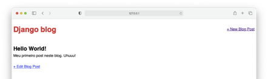


Se você clicar nesse botão (Editar), você será redirecionado para "http://127.0.0.1:8000/post/1/edit/". Se for a sua primeira postagem no Blog, você o número 1 no URL; caso contrário, 2, 3, etc. Observe na figura abaixo que o formulário é pré-preenchido com os dados existentes do Banco de Dados para a postagem. Vamos fazer uma alteração em um dos campos (e.g. `Title`).

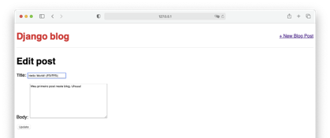


> E depois de clicar no botão “**Update**” somos redirecionados para a visão detalhada da postagem onde você pode ver a alteração. Isso ocorre por causa de nossa configuração `get_absolute_url` (**Passo 2.6**). Veja a figura abaixo.

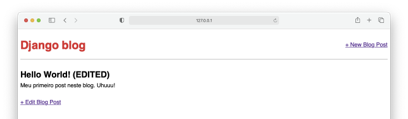


3.6) Agora, navegue até a página inicial ("http://127.0.0.1:8000") e você pode ver a alteração efetuada (figura abaixo).

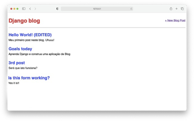


Na linha de comando, caso necessário, feche o servidor existente com "CTRL+C".


## **Passo 4: Criando um Formulário de Exclusão (Delete)**

O processo de criação de um formulário para excluir postagens do Blog é muito semelhante ao de atualização, que fizemos no passo anterior. Usaremos outra visão genérica baseada em classe, chamada [`DeleteView`](https://docs.djangoproject.com/pt-br/5.0/ref/class-based-views/generic-editing/#django.views.generic.edit.DeleteView "Views de edição genérica - DeleteView"), para criar a “**view**”, **URL** e “**template**” necessários.


4.1) Vamos começar adicionando um link para excluir postagens em nossa página individual do Blog, que chamamos de “**post_detail.html**”. Para isto, abra o arquivo “**post_detail.html**” que está na pasta “**templates**” e substitua todo o seu conteúdo pelo código abaixo.

```html
<!-- templates/post_detail.html -->



   <div class="post-entry">
      <h2>{{ post.title }}</h2>
      <p>{{ post.body }}</p> 
   </div>

   <p><a href="">+ Edit Blog Post</a></p>
   <p><a href="">+ Delete Blog Post</a></p> 

```


4.2) Em seguida, precisamos criar um “**template**” para nossa página de exclusão chamada “**post_delete.html**”. Para isto, crie um arquivo chamado “**post_delete.html**” no diretório “**templates**”. Dentro dele adicione o código abaixo.

```html
<!-- templates/post_delete.html -->



   <h1>Delete post</h1>
   <form action="" method="POST">
      <p>Are you sure you want to delete "{{ post.title }}"?</p>
      <input type="submit" value="Confirm"> 
   </form>

```


4.3) Agora precisamos atualizar nossa “**View**”. Abra o arquivo “**blog/views.py**” que está no diretório “**blog**” e substitua todo seu conteúdo pelo código abaixo.

```python
# blog/views.py
from django.views.generic import ListView, DetailView 
from django.views.generic.edit import (CreateView, UpdateView, DeleteView)
from django.urls import reverse_lazy
from .models import Post

class BlogListView(ListView): 
	model = Post
   	template_name = 'home.html'

class BlogDetailView(DetailView): 
	model = Post
   	template_name = 'post_detail.html'

class BlogCreateView(CreateView): 
	model = Post
   	template_name = 'post_new.html'
   	fields = ['title', 'author', 'body']

class BlogUpdateView(UpdateView):
	model = Post
   	template_name = 'post_edit.html'
	fields = ['title', 'body']

class BlogDeleteView(DeleteView):
	model = Post
   	template_name = 'post_delete.html'
   	success_url = reverse_lazy('home')
```

> Usamos o método [`reverse_lazy`](https://docs.djangoproject.com/pt-br/5.0/ref/urlresolvers/#reverse-lazy "funções utilitárias do Django - reverse_lazy") em vez de apenas [`reverse`](https://docs.djangoproject.com/pt-br/5.0/ref/urlresolvers/#reverse "funções utilitárias do Django - reverse") para que ele não execute o redirecionamento do URL até que nossa “**view**” termine de excluir a postagem do Blog.
> 
 
Abaixo segue uma explicação sucinta sobre os métodos mencionados acima.
 
1. `reverse`:

   Usado para obter o URL correspondente a um nome especificado. Ele é tipicamente usado em situações onde você tem acesso ao objeto de requisição ou está dentro de uma função onde o URL é necessário imediatamente. Por exemplo, ao redirecionar o usuário após uma ação ser concluída, você pode usar `reverse` para gerar o URL de redirecionamento.
   
   Uso: `reverse('nome-do-url', args=[lista de argumentos])`

2. `reverse_lazy`:

   É similar ao `reverse`, mas é avaliado de forma preguiçosa. Isso significa que a resolução do URL não acontece até que o valor seja realmente acessado. Este método é útil em situações onde você precisa usar um URL em um momento em que o sistema de URLs do Django pode ainda não estar totalmente carregado, como em atributos de classe ou em valores padrão de argumentos de métodos.
   
   Uso: `reverse_lazy('nome-da-url', args=[lista de argumentos])`


4.4) Por fim, crie um URL importando nossa “**view**” `BlogDeleteView` e adicionando um novo padrão. Ou seja, substitua o conteúdo do arquivo "**blog/urls.py**" da pasta "**blog**" pelo código abaixo:

```python
# blog/urls.py
from django.urls import path 
from .views import (
    BlogListView,
    BlogDetailView,
    BlogCreateView,
    BlogUpdateView,
    BlogDeleteView,
)
urlpatterns = [
    path('', BlogListView.as_view(), name='home'),
    path('post/new/', BlogCreateView.as_view(), name='post_new'),
    path('post/<int:pk>/', BlogDetailView.as_view(), name='post_detail'),
    path('post/<int:pk>/edit/', BlogUpdateView.as_view(), name='post_edit')
    path('post/<int:pk>/delete/', BlogDeleteView.as_view(), name='post_delete'),
]
```


4.5) Se você iniciar o servidor novamente com o comando `python manage.py runserver` e atualizar qualquer página de postagem individual, você verá o link `+ Delete Blog Post`. Veja figura abaixo.

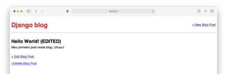


4.6) Clicando no link da figura acima ("http://127.0.0.1:8000/post/1/delete/"), você será direcionado para a página de exclusão da postagem do Blog, a qual exibe o nome desta postagem. Veja a figura abaixo.

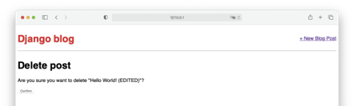

Se você clicar no botão “**Confirm**”, você será direcionado para a página inicial e verá que a postagem do Blog foi excluída!

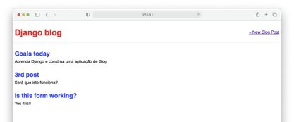


Com este tutorial construímos um aplicativo de Blog que permite criar, ler, atualizar e excluir postagens. Como mencionamos no início deste tutorial, essa funcionalidade central é conhecida pela sigla “**CRUD**: **Create-Read-Update-Delete**”. Por enquanto, ele está funcionando e, no próximo tutorial, adicionaremos contas de usuário para que eles possam se cadastrar, fazer login e logout do aplicativo.


