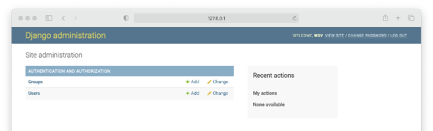

# Tutorial Django 06 - Criando Uma Outra Aplicação Web (Blog)

Neste tutorial vamos construir um Blog que permite aos usuários criar, editar e excluir postagens (i.e. posts). A página inicial (“**homepage**”) listará todas as postagens desse Blog e haverá uma página de detalhes dedicada para cada postagem individualmente. Também vamos utilizar o CSS para estilizar nossas páginas e aprenderemos como o Django funciona com arquivos estáticos (i.e. *CSS* e *JavaScript*). Para isto, siga atentamente os passos abaixo.


**Observação Importante: faça isso somente depois de fazer o Tutorial 01, que trata da instalação do Python e Visual Studio Code.**


## **Passo 1: Configure seu ambiente de desenvolvimento**

Sempre que você estiver iniciando um projeto de desenvolvimento web, é uma boa ideia configurá-lo primeiro.

1.1) Abra o Terminal no VS Code. Primeiro digite (CTRL+Shift+P) e use a opção “**View: Toggle Terminal**” ou “**Ver: Alternar Terminal**”.

1.2) Digite na linha de comando do Terminal:

```
cd Django_Tutoriais
mkdir Tutorial_06
cd Tutorial_06
```

1.3) Uma vez dentro do diretório (“**Tutorial_06**”), crie um ambiente virtual. Para isto, digite o comando a seguir:

```
python3 -m venv blogenv
```

Caso esteja usando o **Windows**:

```
py -m venv blogenv
```

1.4) Agora você precisa ativar o ambiente virtual criado no item anterior, executando o comando abaixo:

**Linux/Mac**

```
source blogenv/bin/activate
```

**Windows**

```
.\blogenv\Scripts\activate.bat
```

Ou

```
.\blogenv\Scripts\Activate.ps1
```

Você saberá que seu ambiente virtual foi ativado, porque o _prompt_ do console no Terminal mudará. Deve ser assim:

```
(blogenv) $
```

1.5) Agora que você criou um ambiente virtual, é hora de instalar o **Django**. Digite na linha de comando:

```
(blogenv) $ pip install django
```

## **Passo 2: Criando seu projeto em Django**

2.1) Certifique-se de que você está dentro do diretório “**Tutorial_06**” e o ambiente virtual ativado. Agora, digite o comando abaixo para criar um projeto.

```
(blogenv) $ django-admin startproject config .
```

**Observação: ao criar um novo projeto Django chamado “config” certifique-se de incluir o ponto (.) no final do comando para que ele seja instalado no diretório atual.**

O comando acima irá criar uma pasta chamada “**config**” contendo alguns arquivos. No painel esquerdo do **VS Code**, você verá uma estrutura de diretório que se parece com a figura abaixo.


## **Passo 3: Testando seu servidor Django**

3.1) Depois que sua estrutura de arquivos estiver configurada, você pode iniciar o servidor de desenvolvimento que já vem embutido no Django. Para verificar se a configuração foi bem-sucedida, execute o seguinte comando no console do Terminal:

```
python manage.py runserver
```

Ao posicionar o mouse no link "http://127.0.0.1:8000/" você verá a seguinte mensagem:


No **Windows** irá aparecer “**Seguir o link (ctrl + click)**”. Ao efetuar esta operação, você será direcionado para uma aba do seu browser, e, se tudo estiver correto, você verá uma página da web como a da figura abaixo.


3.2) Parabéns, você acabou de criar um projeto, nossa configuração está correta e você o testou no servidor de desenvolvimento. Agora o Django está pronto para começarmos a desenvolver.


## **Passo 4: Criando uma aplicação em Django**

Para esta parte do tutorial, criaremos uma “**app**” chamada “**blog**”. Antes, porém, certifique-se de que o servidor local esteja parado digitando “CTRL+C” na linha de comando.

4.1) Para criar uma “**app**”, execute o seguinte comando:

```
python manage.py startapp blog
```

Este comando irá criar um diretório chamado “**blog**” com vários arquivos. Veja a estrutura na figura abaixo.


4.2) Agora que você criou a “**app**”, temos que “instalá-la” no seu projeto. Abra o arquivo (“**config/settings.py**”) e adicione a seguinte linha de código destacada em INSTALLED_APPS: (**Não se esqueça de colocar a vírgula após a _string_**).


Essa linha de código indica que seu projeto agora sabe que o aplicativo que você acabou de criar existe.

Surge uma pergunta: de onde obtivemos a referência a “**blog**”?

Resposta: quando criamos uma nova “**app**”, no **Passo 4.1**, o Django gerou um arquivo chamado “**apps.py**” na pasta “**blog**”. E dentro desse arquivo, ele criou uma classe chamada `PostsConfig`. Essa classe nos permite fazer referência ao aplicativo (i.e. ao “**app**”) para o projeto. O conteúdo do arquivo “**blog/apps.py**” está abaixo.

```python
from django.apps import AppConfig

class BlogConfig(AppConfig):
    default_auto_field = 'django.db.models.BigAutoField'
    name = 'blog'
```

## **Passo 5: Criando um Banco de Dados**

5.1)	Na linha de comando do VS Code, digite o seguinte comando:

```
python manage.py migrate
```

O comando “**migrate**” acima serve para criar um Banco de Dados (BD) inicial com base nas configurações padrões do Django.

Se você olhar dentro do nosso diretório com o comando `ls`, verá que agora existe um arquivo chamado “**db.sqlite3**” que representa esse BD. Por padrão, o Django utiliza o [SQLite](https://www.sqlite.org/index.html "SQLite Home Page") . Futuramente, em outro tutorial, veremos como fazer para utilizar o **MySQL** e/ou **PostGRES**.

Tecnicamente, um arquivo “**db.sqlite3**” é criado na primeira vez que você executa o comando `python manage.py migrate` (**Passo 5.1 acima**) ou o comando 
`python manage.py runserver`. (**Passo 3.1**)

Entretanto, “**migrate**” irá sincronizar o Banco de Dados com o estado atual de quaisquer modelos (“**models**”) de BD contidos no projeto e listados em “INSTALLED_APPS” (**Passo 4.2**). 

Em outras palavras, para garantir que o BD reflita o estado atual do seu projeto, você precisará executar o comando “**migrate**” (e também o comando “**makemigrations**”, que será visto posteriormente) cada vez que atualizar um “**model**”. Este último, veremos em um passo futuro.


5.2) 	Agora, para confirmar se tudo está funcionando corretamente, reinicie nosso servidor no Terminal (`python manage.py runserver`), e visite "http://127.0.0.1:8000". Você deverá a seguinte página da web:


## **Passo 6: Criando um Model ("Modelo") de Banco de Dados**

Quais são as características de um Blog? Em nosso caso, vamos manter as coisas simples e assumir que cada postagem tem um *título*, *autor* e *corpo da mensagem*. Podemos transformar isso em um “**model**” de BD seguindo o passo abaixo:

6.1) Abra o arquivo “**models.py**” no diretório (“**blog/models.py**”). Já existe um trecho de código nele que importa um módulo chamado "**models**”. 

```python
from django.db import models

#Create your models here
```

Agora adicione o seguinte código a este arquivo:

```python
class Post(models.Model):
   title = models.CharField(max_length=200) 
   author = models.ForeignKey(
    	'auth.User',
    	on_delete=models.CASCADE,
   )
   body = models.TextField()

   def __str__(self):
      return self.title
```

Na primeira linha do código acima, estamos importando a classe “**models**” e, em seguida, criando uma classe filha de “**models.Model**” chamada “**Post**”. Usando esta funcionalidade de subclasse (classe filha ou herança), automaticamente temos acesso a tudo dentro de [**django.db.models.Models**](https://docs.djangoproject.com/pt-br/5.0/topics/db/models/ "`Models` no Django") e podemos adicionar campos e métodos adicionais conforme desejado.

Para o título (“**title**”), estamos limitando o comprimento a 200 caracteres e para o corpo da mensagem (“**body**”), estamos usando um `TextField` que se expandirá automaticamente conforme necessário para se ajustar ao texto do usuário. Existem muitos tipos de campo disponíveis no Django. Você pode ver a [lista completa aqui](https://docs.djangoproject.com/pt-br/5.0/topics/db/models/#fields "Field List no Django").

Para o campo do autor (“**author**”), estamos usando uma `ForeignKey`, isto é, uma [chave estrangeira](https://docs.djangoproject.com/en/5.0/ref/models/fields/#django.db.models.ForeignKey) a qual permite um relacionamento do tipo “**muitos para um**” (“**n-to-1**”). Isso significa que um determinado usuário pode ser autor de várias postagens diferentes, mas não o contrário. A referência é o “**model**” embutido chamado “**User**” que o Django fornece para autenticação. Para todos os relacionamentos “**muitos para um**”, como `ForeignKey`, também devemos especificar uma opção [`on_delete`](https://docs.djangoproject.com/en/5.0/ref/models/fields/#django.db.models.ForeignKey.on_delete "Opção `on_delete`").

Agora que nosso novo modelo (“**model**”) foi criado, precisamos ativá-lo. No futuro, sempre que criarmos ou modificarmos um modelo existente, precisaremos atualizar o Django em um processo de duas etapas:

* Criamos um arquivo de migração com o comando `makemigrations`. Este arquivo cria uma referência de quaisquer alterações nos modelos do Banco de Dados, o que significa que podemos rastrear alterações e depurar erros caso necessário.

* Construímos o Banco de Dados real com o comando `migrate`, que executa as instruções no arquivo criado na etapa acima.


6.2) Certifique-se de que o servidor local esteja parado digitando “Control+C” na linha de comando e, em seguida, execute os comandos abaixo: 

```python
python manage.py makemigrations blog
```

```python
python manage.py migrate blog
```


## **Passo 7: Configurando o Módulo “Admin” do Django**


7.1) Para usar o Django “**admin**”, primeiro precisamos criar um super usuário (“**superuser**”) que possa fazer login. No console da linha de comando, digite o comando abaixo e responda aos prompts de nome de usuário (“**Username**”), e-mail (“**Email**”) e senha (“**Password**)”:
 
```
python manage.py createsuperuser
```

Os prompts estão descritos abaixo. Os valores digitados são ilustrativos. Escolha o mais adequado ao seu caso:

```
Username (leave blank to use 'wsv'): admin
Email: admin@learndjango.com
Password:
Password (again):
Superuser created successfully.
```

> **Observação importante: Ao digitar sua senha, ela não aparecerá visível no console da linha de comando por motivos de segurança.**

7.2) Agora, reinicie o servidor no Terminal (`python manage.py runserver`), e no seu browser visite "http://127.0.0.1:8000/admin". Você deverá ver a tela de login do administrador (“**admin**”) que está na figura abaixo:


7.3) Faça o login inserindo o nome de usuário (“**Username**”) e a senha (“**Password**”) que você acabou de criar no **Passo 7.1**. Você verá a página inicial do Django “**admin**” a seguir:



Surge uma pergunta: onde está nosso “**model**” de BD chamado “**Post**”? Ele não é exibido na página principal do administrador! Assim como devemos adicionar explicitamente novos aplicativos à configuração “INSTALLED_APPS”, também devemos atualizar o arquivo “**admin.py**” do nosso aplicativo para que ele apareça no administrador (i.e. “**Django admin**”).

7.4) Abra o arquivo “**admin.py**” no diretório (“**blog/admin.py**”), e adicione o seguinte código para que o “**model**” “**Post**” seja exibido.

```python
# blog/admin.py
from django.contrib import admin 
from .models import Post 

admin.site.register(Post)
```

Agora, o Django sabe que deve exibir nosso “**app**” de “**blog**” e o seu “**model**” (modelo) de BD chamado “**Post**” na página do “**admin**”. Se você atualizar seu browser (navegador), verá que ele aparece:


7.5) Agora vamos adicionar dois posts para o nosso Blog para termos alguns dados de amostra para trabalhar. Clique no botão `+Add` que está do lado oposto de “**Posts**” para criar uma entrada. Certifique-se de adicionar um autor (“**author**”) a cada postagem (“**post**”) também, pois por padrão todos os campos do modelo (“**model**”) são obrigatórios. Veja as figuras abaixo:


Agora que nosso “**model**” de BD está completo, precisamos criar as “**views**”, **URLs** e “**templates**” necessários para que possamos exibir as informações em nosso aplicativo da web.


## **Passo 8: Criando nossas Views/Templates/URLs**

Queremos exibir as postagens do nosso Blog na página inicial (“**homepage**”). E, portanto, vamos configurar nosso arquivo “**config/urls.py**” e, em seguida, nosso arquivo “**blog/urls.py**”.

Na linha de comando, caso necessário, feche o servidor existente com “CTRL+C”.

8.1) Crie um arquivo na pasta “**blog**” chamado “**blog/urls.py**”. Adicione o código abaixo.

```python
from django.urls import path
from .views import BlogListView

urlpatterns = [
    path('', BlogListView.as_view(), name='home'),
]
```

A string vazia ('') acima, diz ao Python para combinar todos os valores e nós demos um nome ao URL (i.e. “home”), à qual podemos nos referir as nossas “Views” mais tarde. Embora seja opcional adicionar um [**URL com nome**](https://docs.djangoproject.com/pt-br/5.0/topics/http/urls/#reverse-resolution-of-urls "resolução reversa de URLs"), é uma prática recomendada que você deve adotar, pois ajuda a manter as coisas organizadas conforme o número de URLs aumenta.

Também devemos atualizar nosso arquivo “**config/urls.py**” para que ele saiba como encaminhar todas as solicitações diretamente para o nosso “**app**” Blog.


8.2) Abra o arquivo “**config/urls.py**”. O seu conteúdo deve ser assim.

```python
from django.contrib import admin
from django.urls import path

urlpatterns = [
    path('admin/', admin.site.urls),
]
```

Altere o conteúdo do arquivo acima para:

```python
from django.contrib import admin
from django.urls import path, include

urlpatterns = [
    path('admin/', admin.site.urls),
    path('', include('blog.urls')),
]
```

Neste tutorial, também vamos usar uma “**View**” baseada em classe. 

8.3) Abra o arquivo “**views.py**” no diretório (“**blog/views.py**”). Adicione o código abaixo nele. 

```python
# blog/views.py
from django.views.generic import ListView 
from .models import Post 

class BlogListView(ListView):
   model = Post 
   template_name = 'home.html'
```

> Na primeira linha, importamos “**ListView**” e na segunda linha importamos o “**model**” “**Post**”. Na “**View**” que chamamos de `BlogListView`, criamos uma classe filha de `ListView` e especificamos o “**model**” e o “**template**” corretos.


8.4) Em seguida, atualize o campo “DIRS” em nosso arquivo “**config/settings.py**” para que o Django saiba como olhar para este diretório de “**templates**”.

```python
# config/settings.py
TEMPLATES = [
   {
      ...
      'DIRS': [str(BASE_DIR.joinpath('templates'))],
      ...
   }, 
] 
```

8.5) Crie um diretório chamado “**templates**” usando o comando (`mkdir templates`) dentro da pasta “**blog**”. Neste diretório que você acabou de criar (i.e. “**templates**”) crie arquivo chamado “**base.html**”. Dentro dele coloque o seguinte código:

```html
<!-- templates/base.html -->
<html> 
  <head>
     <title>Django blog</title> 
  </head>
  <body> 
    <header>
      <h1><a href="">Django Blog</a></h1>
    </header>
    <div>
      
       
    </div>
  </body> 
</html> 
```

> Observe que o código entre `` e `` pode ser preenchido por outros “**templates**”. 


8.6) Agora, no diretório (“**templates**”), crie um arquivo chamado “**home.html**”. Dentro dele coloque o seguinte código:

```html
<!-- templates/home.html -->



   
      <div class="post-entry">
         <h2><a href="">{{ post.title }}</a></h2> 
         <p>{{ post.body }}</p>
      </div>
   

```

> Na segunda linha do código acima note que esse “**template**” estende (ou seja, herda de) “**base.html**” e, em seguida, envolve nosso código desejado com blocos de conteúdo. Usamos a “**Django Templating Language**” para configurar um loop `for` simples para cada postagem do Blog. Observe que `object_list` vem de “**ListView**” e contém todos os objetos incluídos no BD.


8.7) Agora, ao reiniciar o servidor no Terminal (`python manage.py runserver`), visite "http://127.0.0.1:8000". Você deverá a seguinte página da web:


##### A aparência da página está horrível. Precisamos consertar isso!


## **Passo 9: Trabalhando com Arquivos Estáticos**


Precisamos adicionar algumas regras de CSS ao nosso projeto para melhorar o estilo dele. Tanto o CSS, o JavaScript e as imagens são a peça central de qualquer aplicativo da web moderno e, no mundo do Django, são chamados de "*arquivos estáticos – static files*". O Django oferece uma enorme flexibilidade em torno de como esses arquivos são usados, mas isso pode causar muita confusão para os iniciantes.

Por default, o Django irá procurar dentro de cada “**app**” por uma pasta (diretório) chamada “**static**”. Em outras palavras, um diretório chamado “**blog/static/**”. Se você se lembra, isso é semelhante a como os “**templates**” também são tratados.

Como os projetos Django crescem em complexidade com o tempo e têm vários “**apps**”, geralmente é mais simples raciocinar sobre os arquivos estáticos se eles estiverem armazenados em um único diretório em nível de projeto. Essa é a abordagem que vamos usar.

9.1) Caso necessário, saia do servidor local com “CTRL+C” e crie um diretório chamado “**static**” na mesma pasta onde está o arquivo “**manage.py**”, ou seja, a pasta é “**Tutorial_06**”. Para isto, na linha de comando digite o comando abaixo:

```
(blogenv) $ mkdir static
```


9.2) Abra o arquivo “**config/settings.py**”. Observe que no fim deste arquivo você encontra uma linha de configuração (veja abaixo):

```python
# config/settings.py
STATIC_URL = '/static/'
```

[`STATIC_URL`](https://docs.djangoproject.com/pt-br/5.0/ref/settings/#std:setting-STATIC_URL "URL Estática") é a localização do URL dos arquivos estáticos em nosso projeto, também conhecidos como “**/static/**”.

Configurando [STATICFILES_DIRS](https://docs.djangoproject.com/pt-br/5.0/ref/settings/#staticfiles-dirs "configurando STATICFILES-DIRS"), podemos dizer ao Django onde procurar por arquivos. 


9.3) Agora, no arquivo “**config/settings.py**”, conteúdo dele com o trecho abaixo, o qual diz ao Django para procurar pela nossa recém-criada pasta “**static**” (**Passo 9.1**).

```python
# config/settings.py
STATIC_URL = '/static/'
STATICFILES_DIRS = [str(BASE_DIR.joinpath('static'))]
```


9.4) Crie um diretório chamado “**css**” dentro da pasta “**static**” com o comando abaixo:

```
mkdir static/css
```

9.5) Crie um arquivo chamado “**base.css**” dentro da pasta “**static/css/base.css**”, e digite o seguinte código:

```html
/* static/css/base.css */
header h1 a { 
   color: red;
}
```


9.6) Agora precisamos adicionar os arquivos estáticos aos nossos “**templates**” adicionando o comando `` ao início do arquivo “**base.html**”. Após isto, inclua uma nova linha na parte inferior do código “**<head> </head>**” que referencia explicitamente nosso novo arquivo “**base.css**”. Abra o arquivo “**templates/base.html**” e adicione o conteúdo abaixo:

```html
<!-- templates/base.html -->
 
<html>
  <head>
     <title>Django blog</title>
     <link rel="stylesheet" href="">
  </head> 
...
```

Isso foi um pouco chato, mas é um incômodo que só acontece uma vez. Agora podemos adicionar arquivos estáticos ao nosso diretório “**static**” e eles aparecerão automaticamente em todos os nossos “**templates**”.


9.7) Se você retornar à página inicial no seu browser ("http://127.0.0.1:8000/"), verá que nossa “homepage” está atualizada. Para isto, carregue o servidor (`python manage.py runserver`).


9.8) Que tal adicionar uma fonte (tipo de letra) e um pouco mais de CSS? Para isto, abra o arquivo “**base.html**” que está no diretório “**templates/base.html**” e acrescente a linha de código abaixo (em destaque):

```html
<!-- templates/base.html -->
 
<html>
  <head>
    <title>Django blog</title>
    <link href="https://fonts.googleapis.com/css?family=Source+Sans+Pro:400" rel="stylesheet">

    <link href="" rel="stylesheet">    
  </head>
...
```

9.9) Agora atualize o arquivo “**base.css**” que está no diretório “**static/css/base.css**” com o código abaixo:

```html
/* static/css/base.css */
body {
  font-family: 'Source Sans Pro', sans-serif; 
  font-size: 18px;
}

header {
  border-bottom: 1px solid #999; 
  margin-bottom: 2rem;
  display: flex;
}

header h1 a {
  color: red; 
  text-decoration: none;
}

.nav-left { 
  margin-right: auto;
}

.nav-right { 
  display: flex; 
  padding-top: 2rem;
}

.post-entry { 
  margin-bottom: 2rem;
}

.post-entry h2 { 
  margin: 0.5rem 0;
}

.post-entry h2 a, 
.post-entry h2 a:visited {
  color: blue;
  text-decoration: none; }

.post-entry p { 
  margin: 0; 
  font-weight: 400;
}

.post-entry h2 a:hover { 
  color: red;
}
```


9.10) Se você retornar à página inicial no seu browser ("http://127.0.0.1:8000/"), verá que nossa “**homepage**” está atualizada.


---

## **Passo 10: Criando Páginas Individuais no Blog**

Seria interessante se pudéssemos visualizar as postagens do nosso blog como páginas individuais. Ou seja, cada postagem vista individualmente em uma página. Como vamos fazer isto? Precisamos criar uma “**View**”, um “**URL**” e um “**template**”. Espero que você esteja entendendo um padrão no desenvolvimento com Django.


10.1) Comece com a “**View**”. Vamos usar uma classe genérica chamada [`DetailView`](https://docs.djangoproject.com/pt-br/5.0/ref/class-based-views/generic-display/#django.views.generic.detail.DetailView "Views de exibição genérica") para simplificar as coisas. Na parte superior do arquivo, adicione `DetailView` à lista dos “**imports**” e, a seguir, crie nossa “**View**” chamada `BlogDetailView`. Para fazer isto, abra o arquivo “**blog/views.py**” que está na pasta “**blog**” e troque o seu conteúdo com o código abaixo.

```python
# blog/views.py
from django.views.generic import ListView, DetailView
from .models import Post

class BlogListView(ListView): 
   model = Post
   template_name = 'home.html'

class BlogDetailView(DetailView):
   model = Post
   template_name = 'post_detail.html'
```

> Nesta nova “**View**” (`BlogDetailView`), definimos o “**model**” que estamos usando, cujo nome é “**Post**”, e o “**template**” que queremos associado (**“post_detail.html**”). Por default, `DetailView` fornecerá um objeto de contexto que podemos usar em nosso “**template**”, denominado “**object**” ou o nome do nosso “**model**” em minúsculas, que seria “**post**”. Usaremos esta última opção. Além disso, `DetailView` espera uma chave primária ou um _slug_ passado a ele como o identificador. Não se preocupe com isto agora. Veremos mais sobre isso futuramente.

O que é um _slug_? O ChatGPT o define assim:
>No contexto do framework Django, usado para desenvolvimento web com Python, um _slug_ é uma parte de um URL que é usada para identificar uma página específica de maneira legível e amigável para os motores de busca e para os usuários. Em geral, ele é uma versão simplificada do título de uma página ou de um post, contendo apenas letras, números, hífens ou sublinhados. *Slugs* são usados para criar URLs que são fáceis de ler e lembrar, e que melhoram o SEO (Search Engine Optimization) de um site.

> Por exemplo, se você tem um artigo chamado "Como Fazer Bolo de Chocolate", um *slug* possível poderia ser "como-fazer-bolo-de-chocolate". O URL que inclui esse slug pode parecer algo como: `http://exemplo.com/receitas/como-fazer-bolo-de-chocolate`. **Slugs** são especialmente úteis em Django porque permitem mapear URLs para visualizações específicas de forma clara e eficiente.


10.2) Caso necessário, saia do servidor local com “CTRL+C”. Agora crie um arquivo chamado “**post_detail.html**” na pasta “**templates**” e adicione o código abaixo nele.

```html
<!-- templates/post_detail.html -->



   <div class="post-entry">
     <h2>{{ post.title }}</h2>
     <p>{{ post.body }}</p> 
   </div>

```

Na primeira linha de código, especificamos que este “**template**” é herdado de “**base.html**”. Observe que o “**post.title**” e o “**post.body**” são o nosso objeto de contexto, e `DetailView` o torna acessível.


10.3) Agora precisamos adicionar um novo `URLConf` para nossa “**View**”. Para isto, abra o arquivo “**blog/urls.py**” que está no diretório “**blog**”, e substitua o seu conteúdo com o código abaixo:

```python
# blog/urls.py
from django.urls import path
from .views import BlogListView, BlogDetailView

urlpatterns = [
    	path('', BlogListView.as_view(), name='home'),
        path('post/<int:pk>/', BlogDetailView.as_view(),
      	name='post_detail'),
]
```

> Todas as entradas de postagem do nosso Blog começarão com “**post/**”. A seguir está a chave primária (“**primary key**”) para nossa entrada da postagem, que será representada como um inteiro `<int:pk>`. 

> Chave primária? Você provavelmente está perguntando. O Django adiciona automaticamente uma [chave primária](https://docs.djangoproject.com/pt-br/5.0/topics/db/models/#automatic-primary-key-fields "campos de chave primária automáticos") com auto incremento (`auto-increment`) aos nossos “**models**” de Banco de Dados. 

> Portanto, quando declaramos apenas os campos “**title**”, “**author**” e “**body**” em nosso “**model**” chamado “**Post**” (**Passo 6.1**), o Django também adicionou outro campo chamado `id`, que é nossa chave primária. Podemos acessá-la como `id` ou `pk`.

> A título de exemplo, a `pk` do nosso primeiro “**post**” “**Hello, World**” é 1. Para o segundo “**post**”, é 2, e assim por diante. Portanto, quando formos para a página de entrada individual de nossa primeira postagem, podemos esperar que seu “**urlpattern**” seja `post/1/`.


10.4) Se você agora iniciar o servidor com `python manage.py runserver`, verá uma página dedicada para nossa primeira postagem no Blog em "http://127.0.0.1:8000/post/1/", representada na figura abaixo.


Uau! Você também pode acessar "http://127.0.0.1:8000/post/2/" para ver a segunda entrada (ver figura abaixo).


10.5) Para tornar nossa vida mais fácil, devemos atualizar o link na página inicial (“**homepage**”) para que possamos acessar diretamente as postagens individuais do Blog a partir dela. Atualmente, em “**home.html**” nosso link está vazio: `<a href="">`, e devemos atualizá-lo. Para isto, abra o arquivo “**templates/home.html**” que está na pasta “**templates**” e atualize todo o seu conteúdo com o código abaixo.

```html
<!-- templates/home.html -->



    
      <div class="post-entry">
         <h2><a href="">{{ post.title }}</a></h2>
         <p>{{ post.body }}</p> 
      </div>
   

```


> Começamos dizendo ao nosso modelo Django que queremos fazer referência a um `URLConf` usando o código ``. 
> 
> Qual URL? Aquele que demos o nome de “**post_detail**”, em `BlogDetailView` (**Passo 10.3**). 
> 
> Observe também que, se olharmos para “**post_detail**” em nosso `URLConf`, vemos que ele espera receber um argumento `pk` representando a chave primária para a postagem do Blog. Felizmente, o Django já criou e incluiu este campo (`pk`) em nosso objeto “**post**”. Nós o passamos para o `URLConf` adicionando-o ao “**template**” como “**post.pk**”.


10.6) Para confirmar se tudo está funcionando, atualize a página principal em "http://127.0.0.1:8000/" e clique no título de cada postagem do blog para confirmar se os novos links funcionam (figura abaixo).


Agora se você posicionar o ponteiro do mouse no texto “**Hello World!**” verá que ele aponta para o URL "http://127.0.0.1:8000/post/1/" (ver figura abaixo).


Se você repetir a ação anterior com o texto “**Goals today**”, também haverá um link apontando para o URL "http://127.0.0.1:8000/post/2/". (Ver figura abaixo).


