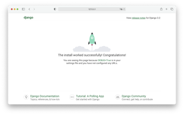
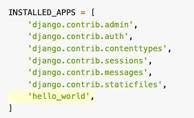
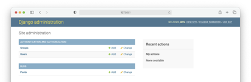

# Tutorial Django 05 - Criando Uma Aplicação Web Chamada de Quadro de Mensagens (Message Board)

Neste tutorial vamos construir um Quadro de Mensagens. Para isto, siga atentamente os passos abaixo.

**Observação Importante: faça isso somente depois de fazer o Tutorial 01, que trata da instalação do Python e Visual Studio Code.**

## **Passo 1: Configure seu ambiente de desenvolvimento**

Sempre que você estiver iniciando um projeto de desenvolvimento web, é uma boa ideia configurá-lo primeiro.

1.1) Abra o Terminal no VS Code. Primeiro digite (CTRL+Shift+P) e use a opção “**View: Toggle Terminal**” ou “**Ver: Alternar Terminal**”.

1.2) Digite na linha de comando do Terminal:

```
cd Django_Tutoriais
mkdir Tutorial_05
cd Tutorial_05
```

1.3) Uma vez dentro do diretório (“**Tutorial_05**”), crie um ambiente virtual. Para isto, digite o comando a seguir:

```
python3 -m venv mbenv
```

Caso esteja usando o **Windows**:

```
py -m venv mbenv
```

1.4) Agora você precisa ativar o ambiente virtual criado no item anterior, executando o comando abaixo:

**Linux/Mac**

```
source mbenv/bin/activate
```

**Windows**

```
.\mbenv\Scripts\activate.bat
```

Ou

```
.\mbenv\Scripts\Activate.ps1
```

Você saberá que seu ambiente virtual foi ativado, porque o _prompt_ do console no Terminal mudará. Deve ser assim:

```
(mbenv) $
```

1.5) Agora que você criou um ambiente virtual, é hora de instalar o **Django**. Digite na linha de comando:

```
(mbenv) $ pip install django
```

## **Passo 2: Criando seu projeto em Django**

2.1) Certifique-se de que você está dentro do diretório “**Tutorial_05**” e o ambiente virtual ativado. Agora, digite o comando abaixo para criar um projeto.

```
(mbenv) $ django-admin startproject config .
```

**Observação: ao criar um novo projeto Django chamado “config” certifique-se de incluir o ponto (.) no final do comando para que ele seja instalado no diretório atual.**

O comando acima irá criar uma pasta chamada “**config**” contendo alguns arquivos. No painel esquerdo do **VS Code**, você verá uma estrutura de diretório que se parece com a figura abaixo.


## **Passo 3: Testando seu servidor Django**

3.1) Depois que sua estrutura de arquivos estiver configurada, você pode iniciar o servidor de desenvolvimento que já vem embutido no Django. Para verificar se a configuração foi bem-sucedida, execute o seguinte comando no console do Terminal:

```
python manage.py runserver
```

Ao posicionar o mouse no link "http://127.0.0.1:8000/" você verá a seguinte mensagem:


No **Windows** irá aparecer “**Seguir o link (ctrl + click)**”. Ao efetuar esta operação, você será direcionado para uma aba do seu browser, e, se tudo estiver correto, você verá uma página da web como a da figura abaixo.



3.2) Parabéns, você acabou de criar um projeto, nossa configuração está correta e você o testou no servidor de desenvolvimento. Agora o Django está pronto para começarmos a desenvolver.


## **Passo 4: Criando uma aplicação em Django**

Para esta parte do tutorial, criaremos uma “**app**” chamada "**posts**".

4.1) Para criar uma “**app**”, execute o seguinte comando:

```
python manage.py startapp posts
```

Este comando irá criar um diretório chamado “**pages**” com vários arquivos. Veja a estrutura na figura abaixo.


4.2) Agora que você criou a “**app**”, temos que “instalá-la” no seu projeto. Abra o arquivo (“**config/settings.py**”) e adicione a seguinte linha de código destacada em INSTALLED_APPS: (**Não se esqueça de colocar a vírgula após a _string_**).



Essa linha de código indica que seu projeto agora sabe que o aplicativo que você acabou de criar existe.

Surge uma pergunta: de onde obtivemos a referência a “**posts**”?

Resposta: quando criamos uma nova “**app**”, no **Passo 4.1**, o Django gerou um arquivo chamado “**apps.py**” na pasta “**posts**”. E dentro desse arquivo, ele criou uma classe chamada `PostsConfig`. Essa classe nos permite fazer referência ao aplicativo (i.e. ao “**app**”) para o projeto. O conteúdo do arquivo “**posts/apps.py**” está abaixo.

```python
from django.apps import AppConfig

class PostsConfig(AppConfig):
  default_auto_field = 'django.db.models.BigAutoField'
  name = 'posts'
```

## **Passo 5: Criando um Banco de Dados**

5.1)	Na linha de comando do VS Code, digite o seguinte comando:

```
python manage.py migrate
```

O comando “**migrate**” acima serve para criar um Banco de Dados (BD) inicial com base nas configurações padrões do Django.

Se você olhar dentro do nosso diretório com o comando `ls`, verá que agora existe um arquivo chamado “**db.sqlite3**” que representa esse BD. Por padrão, o Django utiliza o [SQLite](https://www.sqlite.org/index.html) . Futuramente, em outro tutorial, veremos como fazer para utilizar o **MySQL** e/ou **PostGRES**.

Tecnicamente, um arquivo “**db.sqlite3**” é criado na primeira vez que você executa o comando `python manage.py migrate` (**Passo 5.1 acima**) ou o comando 
`python manage.py runserver`. (**Passo 3.1**)

Entretanto, “**migrate**” irá sincronizar o Banco de Dados com o estado atual de quaisquer modelos (“**models**”) de BD contidos no projeto e listados em “INSTALLED_APPS” (**Passo 4.2**). 

Em outras palavras, para garantir que o BD reflita o estado atual do seu projeto, você precisará executar o comando “**migrate**” (e também o comando “**makemigrations**”, que será visto posteriormente) cada vez que atualizar um “**model**”. Este último, veremos em um passo futuro.

5.2) 	Agora, para confirmar se tudo está funcionando corretamente, reinicie nosso servidor no Terminal (`python manage.py runserver`), e visite "http://127.0.0.1:8000". Você deverá a seguinte página da web:


## **Passo 6: Criando um Model ("Modelo") de Banco de Dados**

Nossa primeira tarefa é criar um “**model**” onde possamos armazenar e exibir as postagens de nossos usuários. Para isto, usaremos o ORM (*Object-Relational Mapper*) que transformará automaticamente este modelo em uma tabela no BD para nós.

Mas o que é o ORM? 

Um dos recursos mais poderosos do Django é seu Mapeador Objeto-Relacional ou ORM (sigla em inglês), o qual permite que você interaja com seu Banco de Dados, como faria com SQL. Na verdade, o ORM é apenas uma forma “pythonica” de criar SQL para consultar e manipular seu BD e obter resultados também dessa forma. Na verdade, não é apenas uma maneira, mas uma engenharia muito inteligente que aproveita algumas das partes mais complexas do Python para tornar a vida dos desenvolvedores mais fácil.

Em um projeto Django do mundo real, geralmente existem muitos modelos de BD complexos e interconectados, mas em nosso aplicativo (“**app**”) de um quadro de mensagens simples, precisamos apenas de um.

6.1) Abra o arquivo “**models.py**” no diretório (“**posts/models.py**”). Já existe uma linha de código lá que importa um módulo chamado **models**. Este módulo nos ajuda a construir novos modelos, os quais irão “modelar” as características dos dados no nosso BD. Vamos criar um “**model**” para armazenar o conteúdo textual de uma postagem (**post**) do quadro de mensagens.

```python
from django.db import models

#Create your models here
```

Agora adicione o seguinte código a este arquivo:

```python
class Post(models.Model):
	text = models.TextField()
```


Observe que criamos um “**model**” de BD chamado “**Post**”, que contém um texto no campo do BD. Também especificamos o tipo de conteúdo que ele conterá, `TextField()`. Django fornece muitos campos de [**model**](https://docs.djangoproject.com/pt-br/5.0/ref/models/fields/) suportando tipos comuns de conteúdo como caracteres, datas, inteiros, emails e assim por diante.

Agora que nosso novo modelo (“**model**”) foi criado, precisamos ativá-lo. No futuro, sempre que criarmos ou modificarmos um modelo existente, precisaremos atualizar o Django em um processo de duas etapas:

* Criamos um arquivo de migração com o comando “**makemigrations**”. Este arquivo cria uma referência de quaisquer alterações nos modelos do Banco de Dados, o que significa que podemos rastrear alterações e depurar erros caso necessário.

* Construímos o Banco de Dados real com o comando “**migrate**”, que executa as instruções no arquivo criado na etapa acima.

6.2) Certifique-se de que o servidor local esteja parado digitando “Control+C” na linha de comando e, em seguida, execute os comandos abaixo: 

```python
python manage.py makemigrations posts
```

Você verá a seguinte mensagem:

```
Migrations for 'posts':
  posts/migrations/0001_initial.py
    - Create model Post
```

Agora execute este comando:

```python
python manage.py migrate
```

As mensagens serão estas:

```
Operations to perform:
  Apply all migrations: admin, auth, contenttypes, posts, sessions
Running migrations:
  Applying posts.0001_initial... OK
```


## **Passo 7: Configurando o Módulo “Admin” do Django**

Um dos recursos matadores do Django é sua interface de administração já embutida que fornece uma maneira visual de interagir com os dados. Ela surgiu porque o Django foi originalmente construído como um CMS (Content Management System – Sistema de Gerenciamento de Conteúdo) de um jornal. 

A ideia era que os jornalistas pudessem escrever e editar suas histórias no módulo “**admin**” sem precisar mexer no "código". 

Com o tempo, este aplicativo administrativo integrado evoluiu para uma ferramenta fantástica e pronta para uso para gerenciar todos os aspectos de um projeto Django. 


7.1) Para usar o Django “**admin**”, primeiro precisamos criar um super usuário (“**superuser**”) que possa fazer login. No console da linha de comando, digite o comando abaixo e responda aos prompts de nome de usuário (“**Username**”), e-mail (“**Email**”) e senha (“**Password**)”:
 
```
python manage.py createsuperuser
```

Os prompts estão descritos abaixo. Os valores digitados são ilustrativos. Escolha o mais adequado ao seu caso:

```
Username (leave blank to use 'wsv'): admin
Email: admin@learndjango.com
Password:
Password (again):
Superuser created successfully.
```

> **Observação importante: Ao digitar sua senha, ela não aparecerá visível no console da linha de comando por motivos de segurança.**

7.2) Agora, reinicie o servidor no Terminal (`python manage.py runserver`), e no seu browser visite "http://127.0.0.1:8000/admin". Você deverá ver a tela de login do administrador (“**admin**”) que está na figura abaixo:


7.3) Faça o login inserindo o nome de usuário (“**Username**”) e a senha (“**Password**”) que você acabou de criar no **Passo 7.1**. Você verá a página inicial do Django “**admin**” a seguir:


Surge uma pergunta: onde está nosso “**app**” de “**posts**”? Ele não é exibido na página principal do administrador! Assim como devemos adicionar explicitamente novos aplicativos à configuração “INSTALLED_APPS”, também devemos atualizar o arquivo “**admin.py**” do nosso aplicativo para que ele apareça no administrador (i.e. “**Django admin**”).

7.4) Abra o arquivo “**admin.py**” no diretório (“**posts/admin.py**”), e adicione o seguinte código para que o “**model**” “**Post**” seja exibido.

```python
# posts/admin.py
from django.contrib import admin 
from .models import Post 

admin.site.register(Post)
```

Agora, o Django sabe que deve exibir nosso “**app**” de “**posts**” e o seu “**model**” (modelo) de BD chamado “**Post**” na página do “**admin**”. Se você atualizar seu browser (navegador), verá que ele aparece:




7.5) Agora vamos criar nossa primeira postagem no quadro de mensagens para nosso Banco de Dados. Clique no botão “**+Add**” que está do lado oposto de “**Posts**” e insira seu próprio conteúdo no campo de formulário de texto (“**TextField**”). Veja a figura abaixo:


7.6) Em seguida, clique no botão “**Save**”, que o redirecionará para a página principal de “**Post**”. No entanto, se você olhar com atenção, há um problema: nossa nova entrada é chamada “**Post object**” (Objeto de postagem), e isto não é muito descritivo! Observe a figura abaixo:


7.7) Precisamos alterar isso. Abra o arquivo “**models.py**” no diretório “**posts/models.py**”, adicione um novo método ao código. Vamos usar um método mágico do Python chamado `__str__`.

```python
# posts/models.py
from django.db import models 

class Post(models.Model):
    text = models.TextField() 

    def __str__(self):
	return self.text[:50] 
```


Isso exibirá os primeiros 50 caracteres do campo de texto (“**TextField**”). Se você atualizar sua página “**admin**” no browser, verá que ela mudou para uma representação muito mais descritiva e útil da nossa entrada no BD (ver figura abaixo).


Muito melhor! É uma prática recomendada adicionar métodos `__str()__` a todos os seus “**models**” para melhorar sua legibilidade.


## **Passo 8: Criando nossas Views/Templates/URLs**

Para exibir o conteúdo do nosso Banco de Dados em nossa página inicial, temos que conectar nossas “**views**”, “**templates**” e os “**URLs**” que também são chamados de “**URLConfs**”. Esse padrão deve começar a parecer familiar agora, porque você já fez estes procedimentos nos tutoriais anteriores.

Vamos começar com a “**View**”. No **Tutorial 03** (**Passo 6.1**), usamos a classe genérica integrada chamada de [`TemplateView`](https://docs.djangoproject.com/pt-br/5.0/ref/class-based-views/base/#django.views.generic.base.TemplateView) para exibir um arquivo de “**template**” em nossa página inicial. Agora queremos listar o conteúdo do nosso “**model**” do BD. Felizmente, esta também é uma tarefa comum no desenvolvimento web e o Django vem equipado com uma classe genérica chamada [`ListView`](https://docs.djangoproject.com/pt-br/5.0/ref/class-based-views/generic-display/#listview).


8.1) Abra o arquivo “**views.py**” no diretório (“**posts/views.py**”). Adicione o código abaixo nele. 

```python
# posts/views.py
from django.views.generic import ListView 
from .models import Post 

class HomePageView(ListView):
	model = Post 
	template_name = 'home.html'
```

Na primeira linha, importamos `ListView` e na segunda linha importamos o “**model**” “**Post**”. Na “**View**” que chamamos de `HomePageView`, criamos uma classe filha de `ListView` e especificamos o “**model**” e o “**template**” corretos.

Nossa “**View**” está completa, mas ainda precisamos configurar nossos URLs e criar nosso “**template**”. 


8.2) Em seguida, atualize o campo “DIRS” em nosso arquivo “**config/settings.py**” para que o Django saiba como olhar para este diretório de “**templates**”.

```python
# config/settings.py
TEMPLATES = [
   {
      ...
      'DIRS': [str(BASE_DIR.joinpath('templates'))],
      ...
   }, 
] 
```

8.3) Crie um diretório chamado “**templates**” usando o comando (`mkdir templates`) dentro da pasta “**posts**”. Neste diretório que você acabou de criar (i.e. “**templates**”) crie arquivo chamado “**home.html**”. Dentro dele coloque o seguinte código:

```html
<!-- templates/home.html -->
<h1>Message board homepage</h1> 
<ul> 
   
     <li>{{ post.text }}</li> 
   
</ul> 
```

A classe `ListView` retorna automaticamente para nós uma variável de contexto chamada `object_list` que podemos iterar (percorrer) por meio da tag integrada de “**template**” chamada [`for`](https://docs.djangoproject.com/pt-br/5.0/ref/templates/builtins/#std:templatetag-for "tag de template for"). Criaremos nossa própria variável chamada “**post**” e poderemos acessar o campo desejado que desejamos exibir. Ou seja, “**text**”, como `post.text`.

O nome `object_list` não é muito amigável, não é? Em vez disso, podemos fornecer um nome explícito por meio do atributo [`context_object_name`](https://docs.djangoproject.com/pt-br/5.0/topics/class-based-views/generic-display/#making-friendly-template-contexts "Criando contextos de modelo `amigáveis`"). Django é, como sempre, extremamente personalizável.


8.4) Abra o arquivo “**views.py**” no diretório (“**posts/views.py**”). Agora adicione o seguinte código a este arquivo (em destaque):

```python
# posts/views.py
from django.views.generic import ListView 
from .models import Post 

class HomePageView(ListView):
   model = Post 
   template_name = 'home.html'
   context_object_name = 'all_posts_list'
```

Adicionar um nome explícito desta forma torna mais fácil para outros membros de uma equipe, por exemplo um designer, entender e raciocinar sobre o que está disponível no contexto do “**template**”. Agora temos de atualizar esse nosso “**template**”, para que faça referência a `all_posts_list` em vez de `object_list` do **Passo 8.3**.


8.5) Abra arquivo “**home.html**” no diretório “**templates/home.html**”. Altere o conteúdo dele com o seguinte código abaixo:

```html
<!-- templates/home.html -->
<h1>Message board homepage</h1> 
<ul> 
   
     <li>{{ post.text }}</li> 
   
</ul> 
```

8.6) O último passo é configurar nosso **URLConfs**. Vamos começar com o arquivo “**config/urls.py**” onde incluímos nosso “**app**” de “**posts**” e adicionamos o `include` na segunda linha. Para isto, abra o arquivo “**config/urls.py**”. O seu conteúdo deve ser assim.

```python
from django.contrib import admin
from django.urls import path

urlpatterns = [
    path('admin/', admin.site.urls),
]
```

Agora precisamos dizer ao Django explicitamente que precisamos ativar uma “**View**” para um URL específico. Altere o conteúdo do arquivo acima para:

```python
from django.contrib import admin
from django.urls import path, include

urlpatterns = [
    path('admin/', admin.site.urls),
    path('', include(‘posts.urls’)),
]
```

8.7) Crie um arquivo na pasta “**posts**” chamado “**posts/urls.py**”. Adicione o código abaixo.

```python
from django.urls import path
from posts.views import HomePageView

urlpatterns = [
    path('', HomePageView.as_view(), name='home'),
]
```

8.8) Agora, ao reiniciar o servidor no Terminal (`python manage.py runserver`), visite "http://127.0.0.1:8000". Você deverá a seguinte página da web:


## **Passo 9: Adicionando Novos Posts**

Para adicionar novas postagens ao nosso quadro de mensagens, volte ao módulo “**admin**” (digite "http://127.0.0.1:8000/admin" na linha de endereço do seu browser) e crie mais dois posts (ou duas postagens). O meu se parece com a figura abaixo.


Se você retornar à página inicial no seu browser ("http://127.0.0.1:8000/"), verá que ela exibe automaticamente nossas postagens formatadas.


